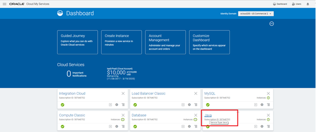
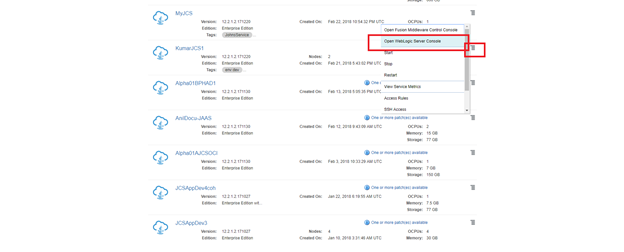
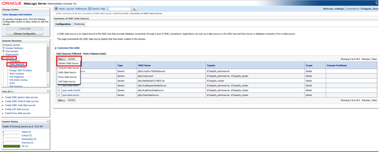
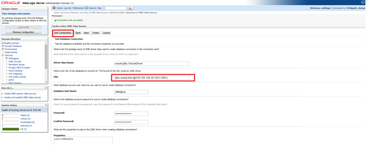
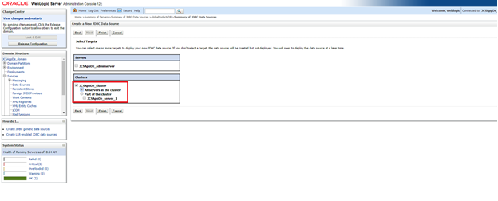

---
# ORACLE Cloud-Native DevOps workshop #

## Creating DB Schema, Loading Application Data and Creating Weblogic DataSource ##

### Introduction ###

This lab goes through the process of loading application data into DBCS. First we would create a Application specific user in DBCS after which we would be creating required tables and loading the application data. 

Once the data loading is complete we would create a DataSocurce in weblogic using which application can access the data.

### Steps ###

There are three major steps in order to deploy an Applcation on JCS:
1. Creating DB schema and loading data
2. Creating weblogic DataSource

#### 1. Log into your Cloud Account ####

+ Click Sign In from cloud.oracle.com

+ From the next page select the appropriate Data Center from the dropdown and click **My Services**

+ In the next screen provide the appropriate identity Domain assigned to you and login using the username password provided.

##### 2. Creating DB Schema and Loading Application Data #####

Before you start loading data into the Database, the SQL port 1521 of your DBCS instace will be diabled by default.

Follow the below steps to enable the port for your appliaction access.

+ Login to your cloud account and click on **Database** from the dashboard

+	Click on **Open Service Console** 

•	Select the hamburger symbol to the right of DBCS instance **Alpha01A-DBCS** and select **Access Rules**

+ Select the hamburger symbol to the right of your of rule **ora_p2_dblistener** and select **Enable**

+ Select **Enable** in the popup screen.

+ Open **Developer cloud Service** and click on the **Project** you have created **Alpha Office**

+ On navigation panel, click **Build** to access the build page and click **New Job**.

+ Give the Job Name as `DBBuild` and click **Save**

+ Click on **Build Steps**

+ Click **Add Build Step**  and select **Invoke SQLcl**

+ Enter the following details

**Username:** `system`

**Password:** `Give the DBCS instance password`

**Credentials File:** `leave it blank`

**Connect String:** `<public IP of DBCS insatce>:1521:ORCL`

**Source:** `SQL File` 

**SQL File Path:** `AlphaOfficeProductCatalogUI/AlphaProducts/ConfigFiles/DB/createUserAlpha.sql`

+ Click **Add Build Step**  and select **Invoke SQLcl**

+ Enter the following details

**Username:** `c##alpha`

**Password:** `Alpha2017_`

**Credentials File:** `leave it blank`

**Connect String:** `<public IP of DBCS insatce>:1521:ORCL`

**Source:** `SQL File` 

**SQL statements:** `AlphaOfficeProductCatalogUI/AlphaProducts/ConfigFiles/DB/createProducts.sql`

+ Click **Save**

+ In the next screen click **Build Now**

##### 3. Creating Weblogic DataSource #####

+ Login to your cloud account and click on **Java** from the dashboard

+ Click on **Open Service console** in the next page

+ Select the hamburger symbol to the right of your JCS instance and select **Open Weblogic Server Console**

+ Log into Weblogic sever console with the `Username / Password` provided

+ From the left pane expand **Services** and select **Data Sources**

+ Click on **New** and then select **Generic Data Source**

+ Provide the following details in the next screen and click Next

**Name:** `AlphaProductsDB`

**JNDI Name:** `jdbc/Alpha01A-DBCS-ds`

**Database type:** `Oracle`

+	Leave all the values as default and click **Next**

+	Leave all the values as default and click **Next**

+ Give the following Connection Properties in the next screen and click **Next**

**Database Name:** `ORCL`

**Host name:** `<Public IP address of DBCS>`

**Port:** `1521`

**Database User Name:** `c##alpha`

**Password:** `Alpha2017_`

+ Change the Connection URL to the format below and click **Test Connection**

 `jdbc:oracle:thin:@< Public IP address of DBCS>:1521:ORCL`
 
 

•	In the next screen select **All Servers in the Cluster** and click **Finish**

 

