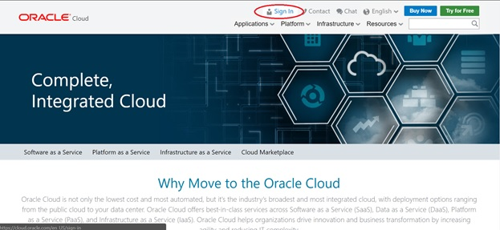
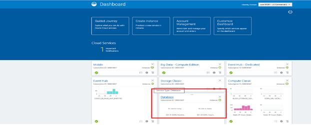
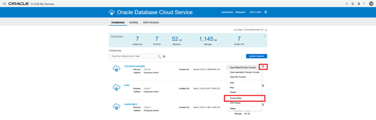
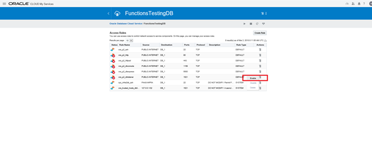
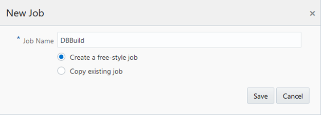
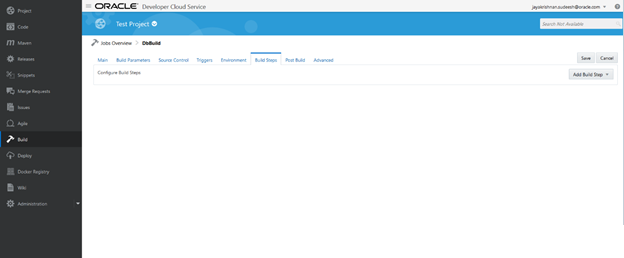

---
# ORACLE Cloud-Native DevOps workshop #

## Creating Db Schema, Loading Application Data and Creating Weblogic DataSource ##

### Introduction ###

This lab goes through the process of loading application data into DBCS. First we would create a Application specific user in DBCS after which we would be creating required tables and loading the application data. 

Once the data loading is complete we would create a DataSocurce in weblogic using which application can access the data.

### Steps ###

There are three major steps in order to deploy an Applcation on JCS:
1. Creating DB schema and loading data
2. Creating weblogic DataSource

#### 1. Log into your Cloud Account ####

+ Click Sign In from cloud.oracle.com

+ From the next page select the appropriate Data Center from the dropdown and click **My Services**

+ In the next screen provide the appropriate identity Domain assigned to you and login using the username password provided.

##### 2. Creating DB Schema and Loading Application Data #####

Before you start loading data into the Database, the SQL port 1521 of your DBCS instace will be diabled by default.

Follow the below steps to enable the port for your appliaction access.

+ Login to your cloud account and click on **Database** from the dashboard

+	Click on **Open Service Console** 

•	Select the hamburger symbol to the right of your DBCS instance and select **Access Rules**

+ Select the hamburger symbol to the right of your of rule **ora_p2_dblistener** and select **Enable**

+ Select **Enable** in the popup screen.

+ Open **Developer cloud Service** and click on the **Project** you have created**Alpha Offic**

+ On navigation panel, click **Build** to access the build page and click **New Job**.

+ Give the Job Name as `DBBuild` and click **Save**

+ Click on **Build Steps**

+ Click **Add Build Step**  and select **Invoke SQLcl**

+ Enter the following details

**Username:** `system`

**Password:** `Give the DBCS instance password`

**Credentials File:** `leave it blank`

**Connect String:** `<public IP of DBCS insatce>:1521:ORCL`

**Source:** `select Inline SQL` 

**SQL statements:** `Copy & Paste the below SQL`

`create user c##alpha identified by Alpha2017_ CONTAINER=ALL;
GRANT CREATE SESSION TO c##alpha CONTAINER=ALL;
grant connect to c##alpha CONTAINER=ALL;
grant all privileges to c##alpha CONTAINER=ALL;
commit;`

