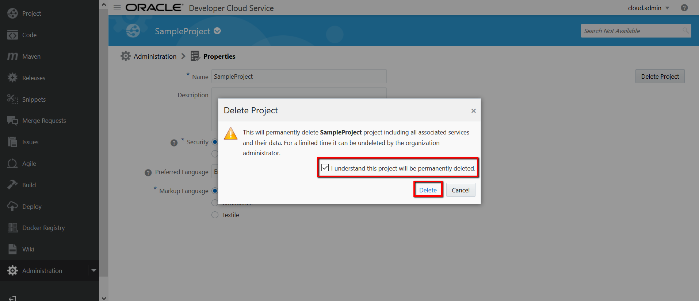
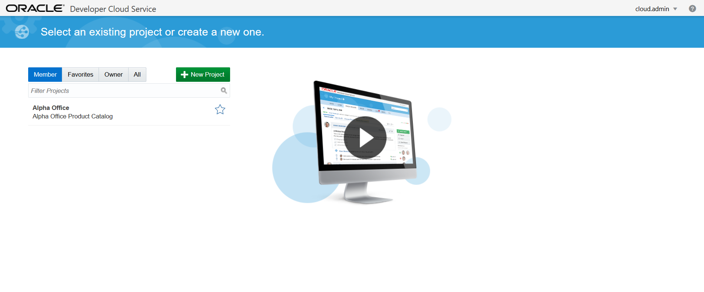

### Deleiting existing DevCS projects ###

If DevCS environment that you have has allready soem projects and you are not able to create a new one then here are steps to delete existing projects:

- on the dashboard open you DevCS console

- in this example we will delete **SampleProject**, click on SampleProject

- you can always see your current project in the top of the page

- on the left hand side menu click on administration

- then click on properties

- and then button Delete project

- confirm and delete

- project is deleted

