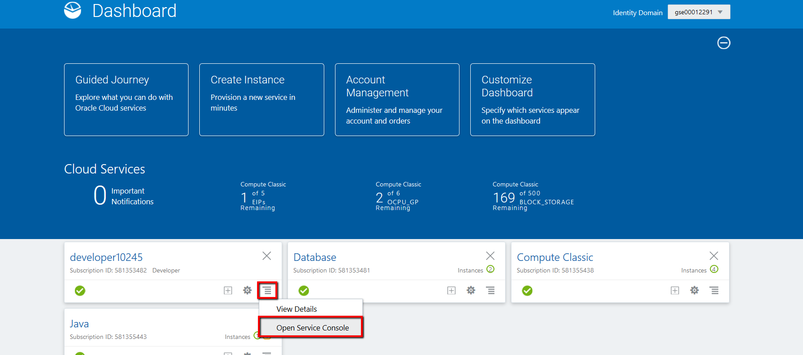
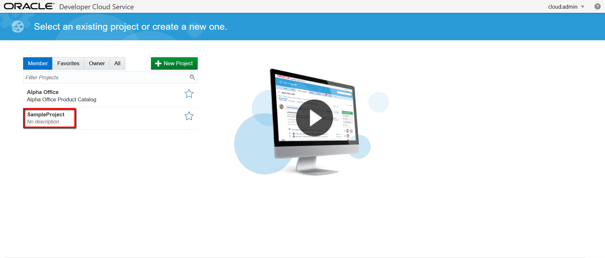
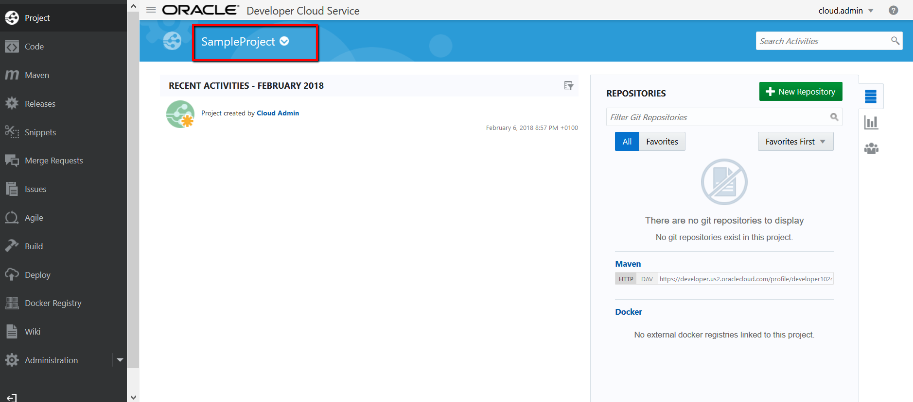
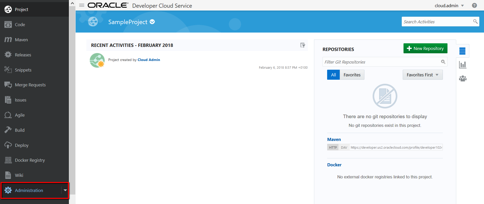
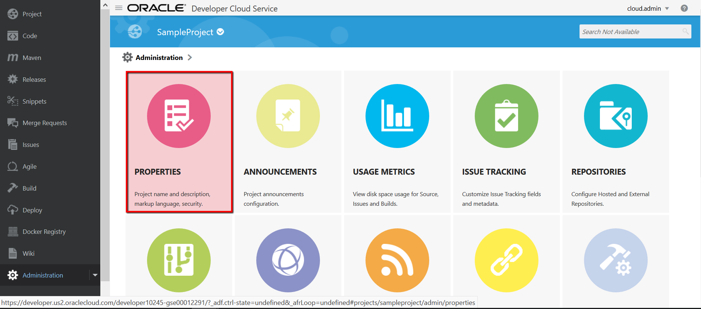
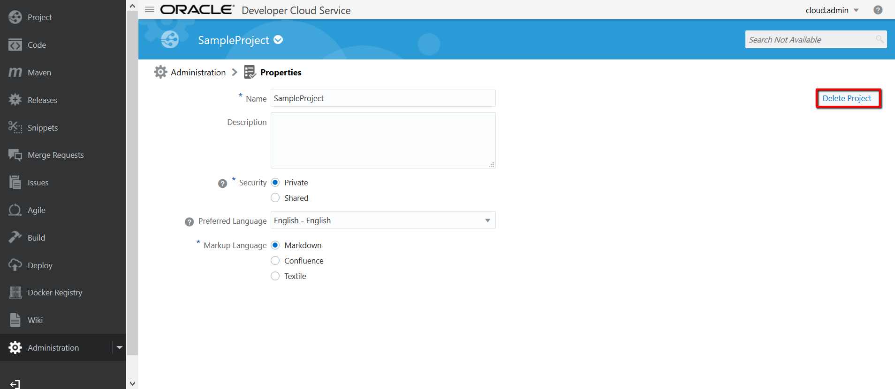

### New Developer Cloud Service Setup ###

Oracle Developer Cloud Service now supports integration with Oracle Cloud Infrastructure Compute Classic and Oracle Cloud Infrastructure Object Storage Classic.

You can create virtual machines (VMs) on Oracle Cloud Infrastructure Compute Classic and use them to run builds of your projects. The archived build artifacts and Maven artifacts are stored on the containers of Oracle Cloud Infrastructure Object Storage Classic.

Before you start creating projects in Oracle Developer Cloud Service, configure Oracle Cloud Infrastructure Compute Classic and Oracle Cloud Infrastructure Object Storage Classic services of your identity domain with Oracle Developer Cloud Service, then create Build VM template with selecting software for your build and create Build VM.

After sign in if you do not see Developer service than, on the My Services   Dashboard page, in the **developer _id_** tile, click **Action**, and select **Open Service Console.**If Oracle Developer Cloud Service isn't listed on the dashboard, click **Customize Dashboard.** Under **Platform,** find **developer _id_,** click **Show,** and then close the **Customize Dashboard** window.

[Configure a connection to Oracle Cloud Infrastructure Storage Classic](http://www.oracle.com/webfolder/technetwork/tutorials/obe/cloud/developer/config_compute_storage/devcs_config_storage.html)

[Configure a connection to Oracle Cloud Infrastructure Compute Classic](http://www.oracle.com/webfolder/technetwork/tutorials/obe/cloud/developer/config_compute_storage/devcs_config_compute.html)

[Create a Build VM template](http://www.oracle.com/webfolder/technetwork/tutorials/obe/cloud/developer/config_buildvm/devcs_create_buildvmtemplate.html)

Software??

[Add Build VMs](http://www.oracle.com/webfolder/technetwork/tutorials/obe/cloud/developer/config_buildvm/devcs_create_buildvm.html)

old
If DevCS environment that you have has already some projects and you are not able to create a new one then here are steps to delete existing projects:

- on the dashboard open you DevCS console

- in this example we will delete **SampleProject**, click on SampleProject

- you can always see your current project in the top of the page

- on the left hand side menu click on administration

- then click on properties

- and then button Delete project

