# Setup for Client Image running on compute #

## Local Git clone ##
Before trying any demo, repoitory cloning is required, we will use Git client integrated with Eclipse tool. Statrt Eclipse using shortcut on desktop.

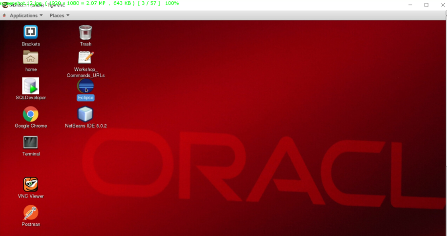

On the toolbar go to Window --> Show View --> Other...

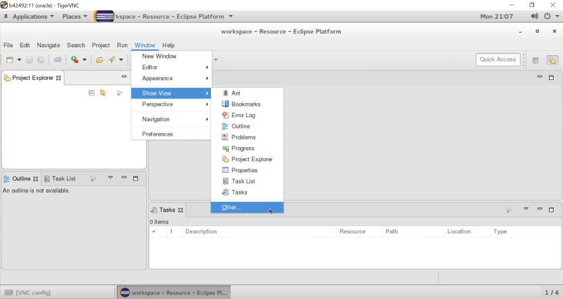

Enter *git* into search field, choose *Git Repositories* and click OK.

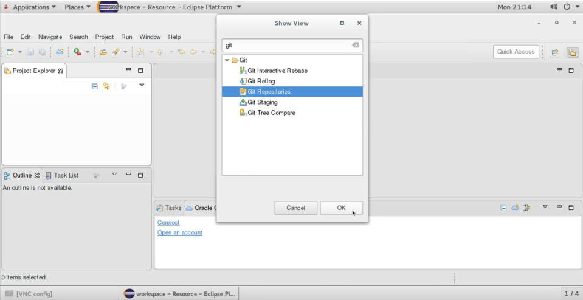

Open browser and go to repository on GitHub, https://github.com/dvukmano/cloud-native-devops-workshop. 

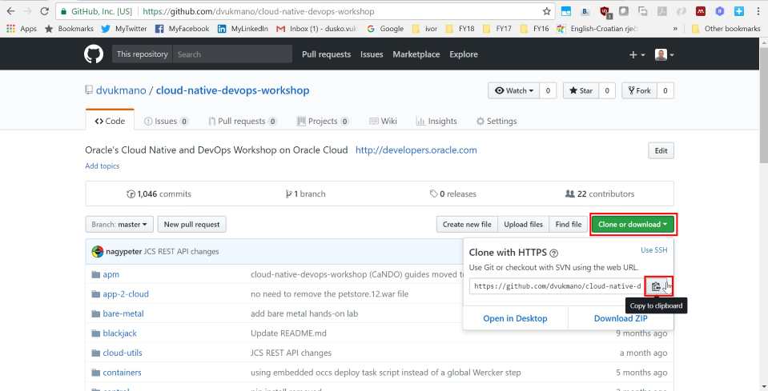

Go back to Eclipse and on *Git Repositories* TAB click on **Clone a Git repository**.

Then click on *Clone URI*, Next.

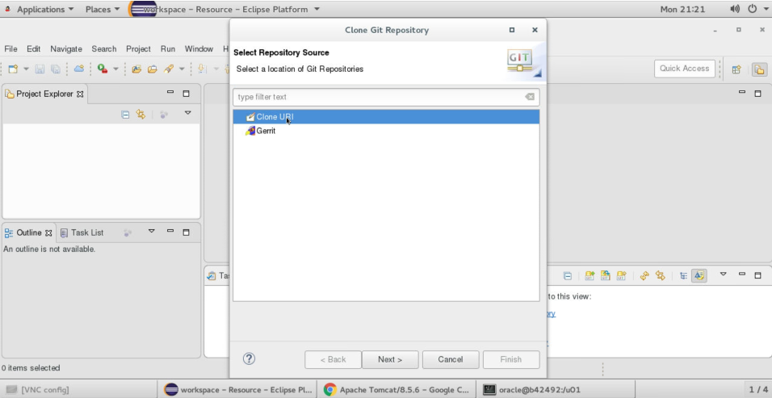

Paste link from github that you copied 3 steps before into field URI, the data should be automatically filled, Next.
- URI: https://github.com/dvukmano/cloud-native-devops-workshop.git
- Host: github.com
- Repository path: /dvukmano/cloud-native-devops-workshop.git

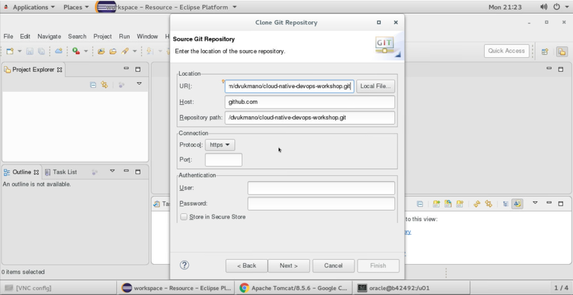

Choose master branch.

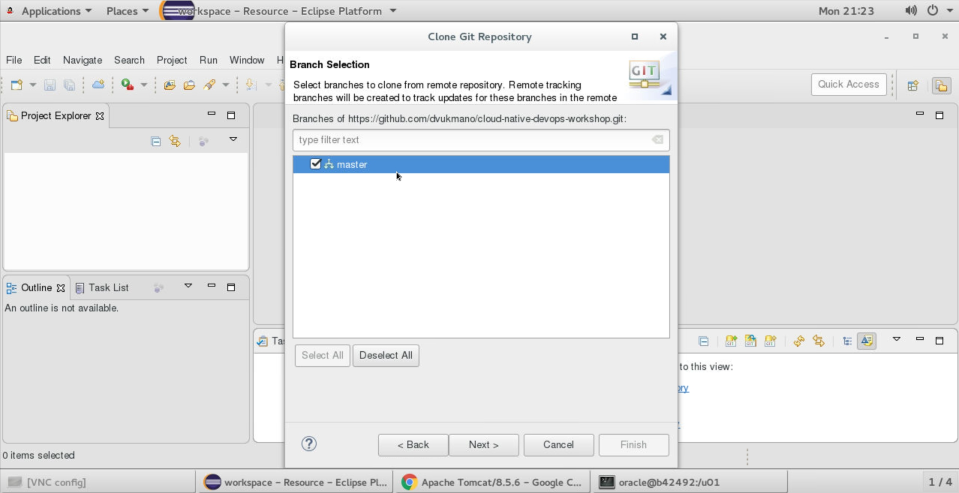

Enter local directory, */u01/content/cloud-native-devops-workshop*

Remote server, *origin*, you can leave, Finish.

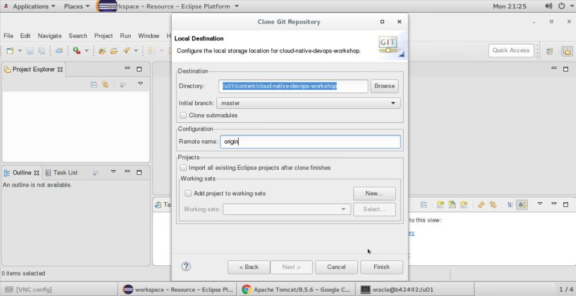

## Maven  ##
When open terminal window, if you need to run maven, firts check if you can run it with:

    [oracle@b42492 OPCWorkshop]$ mvn --version
    bash: mvn: command not found

If not then add maven to PATH and check again:

    [oracle@b42492 OPCWorkshop]$ export PATH=$PATH:/u01/app/oracle/product/netbeans-8.0.2/java/maven/bin/
    [oracle@b42492 OPCWorkshop]$ mvn --version
    Apache Maven 3.0.5 (r01de14724cdef164cd33c7c8c2fe155faf9602da; 2013-02-19 13:51:28+0000)
    Maven home: /u01/app/oracle/product/netbeans-8.0.2/java/maven
    Java version: 1.8.0_101, vendor: Oracle Corporation
    Java home: /u01/app/oracle/product/jdk1.8.0_101/jre
    Default locale: en_US, platform encoding: UTF-8
    OS name: "linux", version: "4.1.12-61.1.34.el7uek.x86_64", arch: "amd64", family: "unix"
    [oracle@b42492 OPCWorkshop]$ 

## Private Key ##
In order to access provisioned servers using ssh you need private key, the private/public key pair Oracle Cloud created during provisioning of servers.

On the main dashboard click on Navigation Menu.

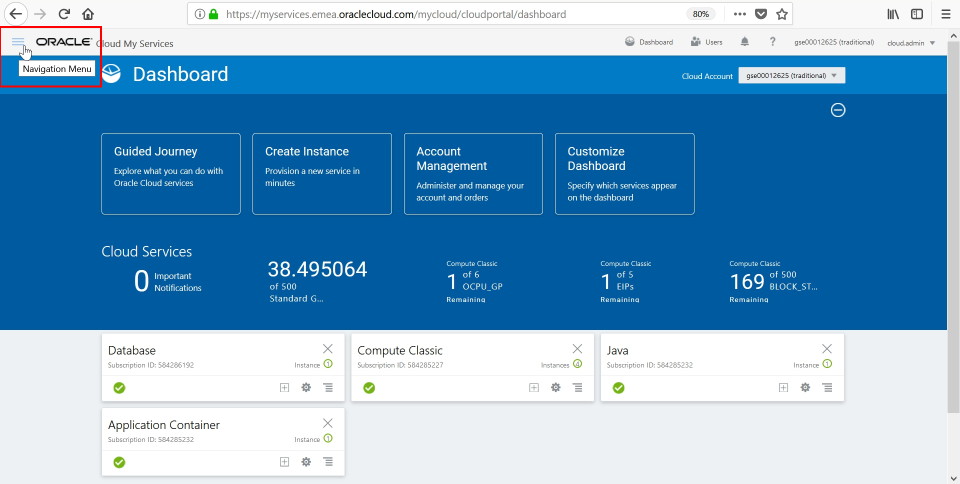

Go to Storage Classic under Services

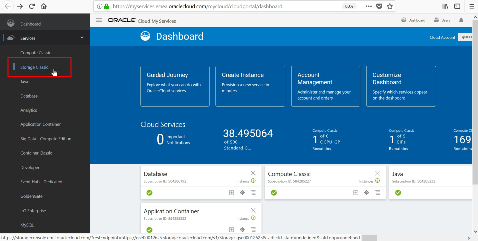

On Container list click on **workshopKeys**

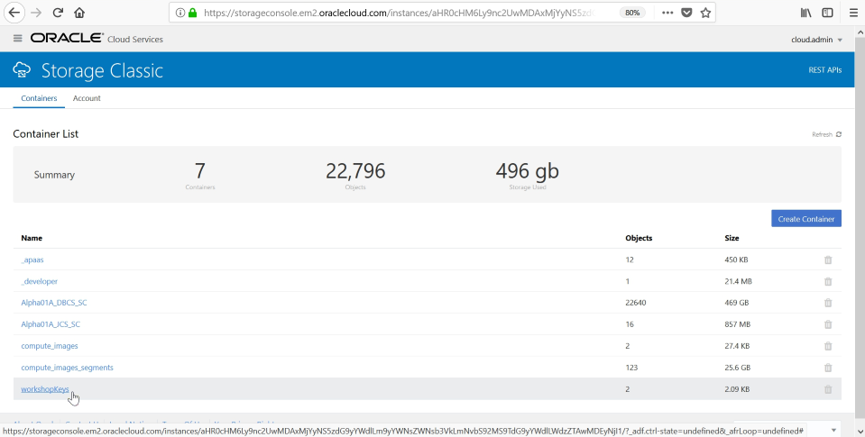

Scroll down and you will see private and public key, on private key's Action menu, on the right, click on Download and save it on local folder.

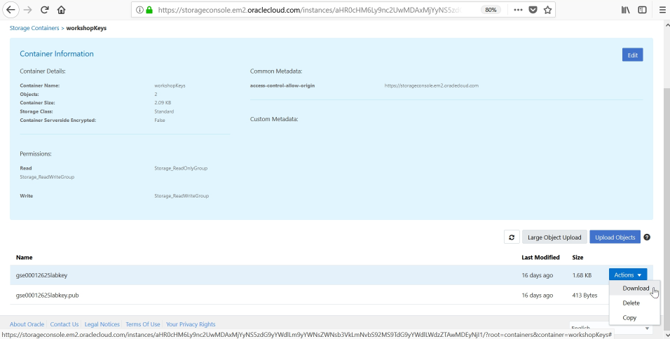

## Python ##
In order to use PSM CLI tool you need to have Python 3.3+, you can check Python version with:
        
        python --version
        
        or
        
        python3 --version

If you need to install newer Python version with pip tool (package management system used to install and manage software packages written in Python) run this commands and create soft links:

        sudo yum install python34
        sudo yum install python34-pip
        sudo ln -s /usr/bin/python3 /bin/python
        sudo ln -s /bin/python3 python

## Alpha2014 passwords ##

weblogic/Alpha2014_

system/Alpha2014_@PDB1
