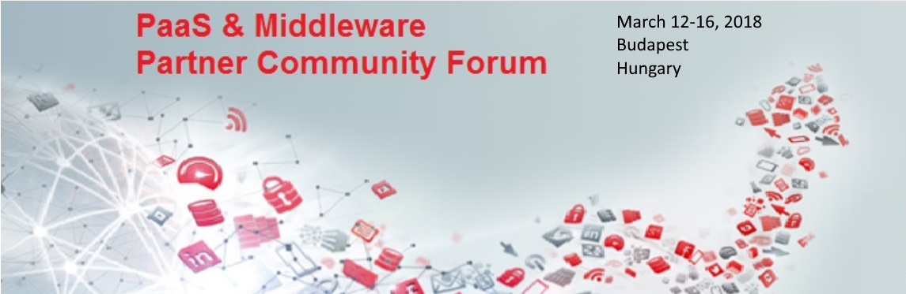

## Prerequisites

#### Client Image vm

This workshop will use Client Image vm provisioned on Oracle Compute with required tools for this workshop, only VNC viewer is nedeed, link for download is on [client tools page](https://github.com/dvukmano/learning-library/blob/PTF-India/workshops/cloud-native-devops-workshop/ClientTools.md). You can use your client environment if you have [required tools](https://github.com/dvukmano/learning-library/blob/PTF-India/workshops/cloud-native-devops-workshop/ClientTools.md).

#### Oracle Public Cloud PaaS  account

The workshop is intended to work with an Oracle GSE account. You should receive email with access details prior to this event. Get the following account details ready to complete the tutorial and replace to your values when it is required:

+ Oracle Cloud account **username** and **password**
+ Oracle Cloud **identity domain**
+ **Data center/region**

---
# ORACLE Cloud-Native DevOps workshop #

## Introduction ##

Oracle Cloud is the industry’s broadest and most integrated public cloud. It offers best-in-class services across software as a service (SaaS), platform as a service (PaaS), and infrastructure as a service (IaaS), and even lets you put Oracle Cloud in your own data center. Oracle Cloud helps organizations drive innovation and business transformation by increasing business agility, lowering costs, and reducing IT complexity. The workshop content shows different aspects of Application Development in the cloud with different set of Oracle Cloud Services.

### Prerequisites ###

In order to run labs it is necessary to setup environment, including source code cloning from github, setup PATH variable for executing maven. Script for environment setup is [here](EnvSetup.md). 

### Important ###

During the execution you will create several public cloud service instances what will be available on the world wide web. Even if these instances are for demo purposes keep in mind it is not a best practice to use weak or known (stored here in the tutorial) passwords especially in such open environment. Thus this workshop content does not recommend any password so you need to define those. You will be asked to provide password at certain points and please remember them for later usage.

The content contains several independent modules that cover different aspects of the application development in the Oracle Cloud. These modules could be executed independently unless you find in the Prerequisites that they are dependent on each other.

----
#### Theme : Java application deployment on Java Cloud Service ####

+ [Creating DB Schema, Loading Application Data and Creating WebLogic DataSource](AppDataLoad-DevCS-DBCS/README.md)
+ [Deploy J2EE Application on JCS using DevCS & DBCS](AppDeploy-JCS-DevCS-DBCS/README.md)

#### Theme: Common Platform Tools  ####

+ [Managing Oracle Java Cloud Service Instances Using the PSM CLI](../psm-jcs-mgmt/README.md)
+ [Creating a Template for Oracle Cloud Stack Manager](stack-template/README.md)

#### Theme : Cloud Native Application Development ####

+ [Anil - Twitter DHCS lab](https://??)

-

+ [Create Oracle Developer Cloud Service project for SpringBoot application](springboot-sample/create.devcs.project.md)
+ [Create continuous build integration using Oracle Developer Cloud Service and Oracle Application Container Cloud Service](springboot-sample/devcs.accs.ci.md)
+ [Using Eclipse IDE (Oracle Enterprise Pack for Eclipse) with Oracle Developer Cloud Service](oepe/setup.oepe.md)

---

## [Contributing](../../CONTRIBUTING.md)

## [License](../../LICENSE.md)
