---
# ORACLE Cloud-Native DevOps workshop #

## Build a Tweet analysis service on Oracle Public Cloud using Cassandra & Spring Data ##

### Introduction ###

This lab goes through the steps to use the Oracle Public Cloud to build a simple Tweet analysis service on Oracle Public Cloud using **Apache Cassandra**, **Spring Data** & **twitter4j**

### Background ###

Oracle Public Cloud now includes Data Hub Cloud Service which offers Apache Cassandra as a managed solution and Oracle Application Container Cloud Service offers a polyglot, cloud native application development platform.

As part of this lab, a service (application) would be consuming a continuous stream of tweets (high velocity data) and persist it the Data Hub Cloud. These tweets will be later queried from Data Hub Cloud using another service (application). The above mentioned (micro) services are deployed to Oracle Application Container Cloud and they enjoy the native integration capability which this platform provides with Data Hub Cloud.

### Prerequisites ###

+ Valid credentials for an Oracle Cloud account
+ An active subscription to Oracle Application Container Cloud Service & Oracle Data Hub Cloud Service
+ The code is available on [GitHub](https://github.com/abhirockzz/accs-cassandra-twitter-timeseries-app)
+ Twitter Account
+ A development environment (Java, Maven, Python, PSM CLI)

### Architecture ###

Here is high level diagram to depict the solution

+ Tweet Producer is a Java app which uses the Twitter streaming API to consume tweets and push them to Cassandra cluster on Data Hub
	+ It’s a Java app and uses [twitter4j](http://twitter4j.org/en/) library to consume the tweet stream
	+ Applies user defined filter criteria/terms to filter relevant tweets from the stream
	+ Pushes the tweet data to Cassandra asynchronously
	+ It provides a REST API to start/stop the app on demand e.g. `/tweets/producer`

+ The Tweet Query service defines a REST API and interacts with Cassandra to fetch tweet data
	+ Its a basic [Spring Boot](https://projects.spring.io/spring-boot/) app which leverages [Spring Data](http://projects.spring.io/spring-data/) and Spring Web
	+ The [Cassandra module](https://projects.spring.io/spring-data-cassandra/) in Spring Data is used to interact with Cassandra
	+ `spring-boot-starter-web module` is used to expose a REST API to query tweet related info

+ Application Container Cloud provides out-of-the-box Service Binding for Data Hub Cloud (if both the services are in the same identity domain). This gives your app a secure communication channel without you having to do anything explicitly and no port related configuration is required at the database infrastructure level.

Here is how the Cassandra data model looks like

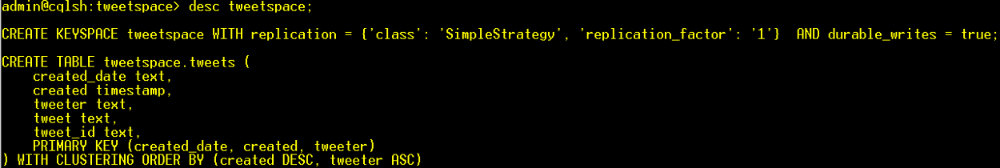

	`tweeter` - the twitter screen name e.g. vmotamar
	`tweet`  - the tweet itself (string format)
	`tweet_id` - the ID of the tweet
	`created` - the time stamp format of when the tweet was created
	`created_date` - the date in text format e.g. 2018–01–01

This table is meant to store tweets in time series style — the primary key is designed keeping this requirement in mind. It consists of a single partition key and clustering columns

`created_date` is the partition key which implies that:

- it is used to determine the partition in which a particular tweet will land
- each partition will contain a day worth of tweets
- only this column can be used in the WHERE clause (unless you create a secondary index) of your query i.e. it allows you to search for all tweets for a particular day (you will see this in action later)

`create` and `tweeter` are clustering columns
	
- they determine how data is sorted on disk and returned in queries
- since `created` column is specified before `tweeter`, the tweet time stamp will be used for sorting (i.e. the latest tweet first) followed by the twitter screen name (alphabetical order)
- you can use the `tweeter` column in a `where` clause (as well) by adding `allow filtering` to the query

### Infrastructure setup steps ###

+ Setup a Cassandra cluster using Oracle Datahub Cloud console and bootstrap Cassandra (keyspace and table)
+ Create a Twitter app which provides us with the required authentication tokens
+ Prepare the code for deployment to Application Container Cloud Service taking the environment variables into consideration

#### Provision Cassandra on Oracle Data Hub Cloud ####

Even though today in this lab, we will be using a pre-provisioned Data Hub instance, here are the steps to set it up.

+ Login to [Oracle Public Cloud](https://cloud.oracle.com/home). Navigate to Data Hub using the Dashboard or the Navigation Menu on the top left corner of the page.

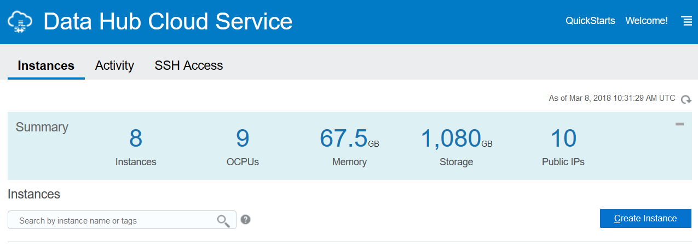

+ Click on Create Instance and fill in the details on the next page. Important items to keep track of are the SSH Key and the Username / Password for the Cassandra Instance(s).

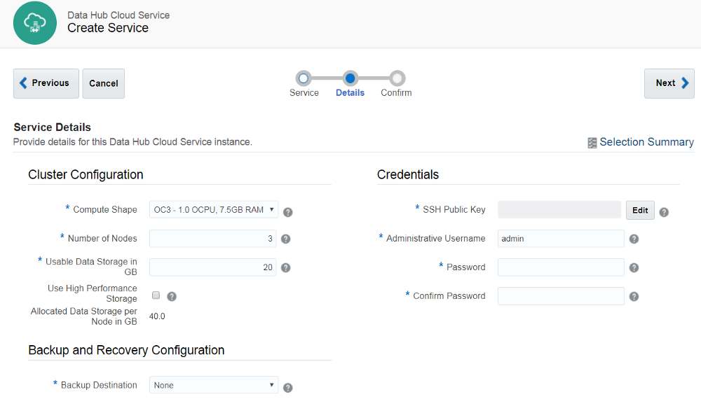

+ Here is an example of a basic single node cluster running Cassandra 3.11.1 

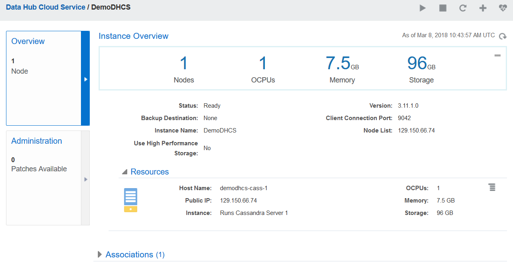

	The `Public IP` is the IP address of the VM on which the Cassandra instance is running. 

+ By default, SSH access to the Data Hub Instance is not enabled. To enable access, click on the menu item on the top right and select `Access Rules`.

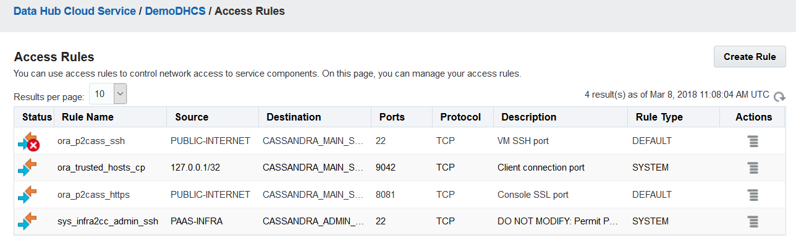

+ `ora_p2cass_ssh` is disabled by default. click on the menu item on the right corner corresponding to this rule and `Enable` the rule. It will take a short amount of time for the rule to be enabled.

+ If we want to allow communication from internet to the Cassandra DB, then we will have to create a new Access Rule. Click on `Create Rule` and fill in the details as shown in figure below

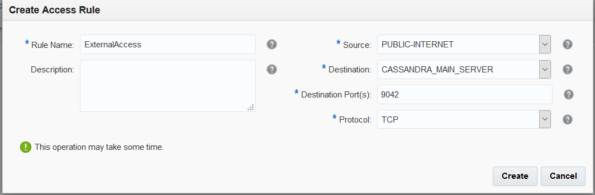

#### SSH to the VM ####

+ A DHCS instance has already been provisioned for the lab. The instructor will share the instance details with you.

+ SSH as `opc` with the `privatekey `to the VM using the `IP address` from the previous step. You could use PuTTY or the SSH command. Further information [here](https://docs.oracle.com/en/cloud/paas/data-hub-cloud/user/connecting-cluster-node-secure-shell-ssh.html#GUID-16765BDA-5713-43C7-82D4-5EE62E31C481)
+ As `oracle` user, log into Cassandra using `cqlsh`
	+ `sudo su oracle`
	+ cqlsh -u admin `hostname`   

#### Create a unique keyspace ####

Choose a unique name for your keyspace and create it. Lets take `tweetspace9464` to proceed. 

`CREATE KEYSPACE tweetspace9464 WITH REPLICATION = { 'class' : 'SimpleStrategy', 'replication_factor' : 1 };`

#### Create table to store tweets ####

Execute the following at the `cqlsh` prompt

- `USE tweetspace9464;` //switch to the appropriate keyspace
- `CREATE TABLE tweets (tweeter text,tweet_id text,tweet text,created timestamp,created_date text,PRIMARY KEY ((created_date), created, tweeter)) WITH CLUSTERING ORDER BY (created DESC);` //create the table
- `desc tweetspace9464;` //confirm

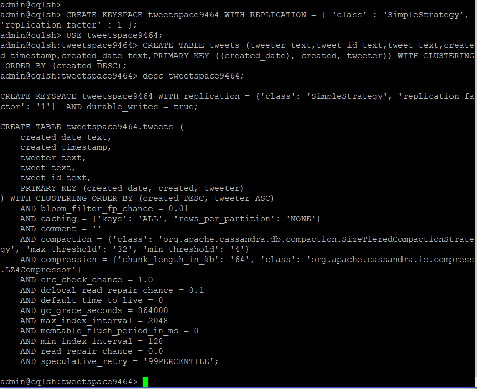

#### Create a Twitter app ####

+ We need a Twitter account. If you dont have already create one.
+ Once the Twitter account is ready, go to https://apps.twitter.com and create a new app. Provide the Name, Description and website values.

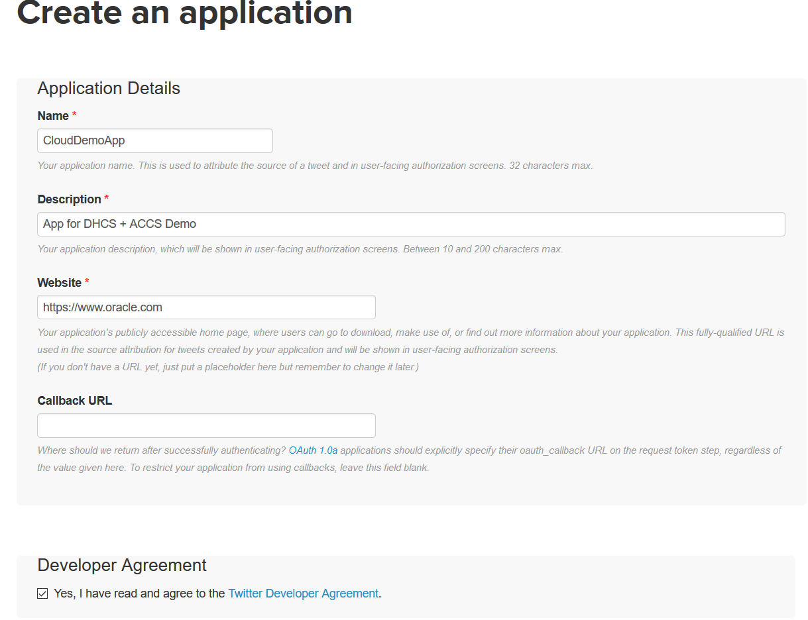

+ Once the app is created, change TAB and go to keys and access tokens section for the app. Note down the Consumer Key (API Key) and Consumer Secret (API Secret).

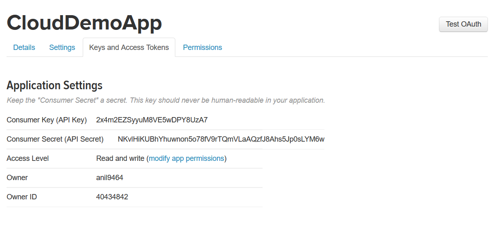

+ Click on ‘Create my Access token’ at the bottom of the screen and note down the Access Token & Access Token Secret values.

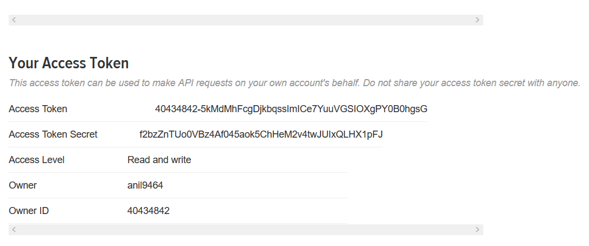

#### Build Application ####

+ Ensure that a development environment is available (Java & Maven should be installed and configured). Get in touch with the instructore for further queries.
+ Start by fetching the project from Github

	`git clone https://github.com/abhirockzz/accs-cassandra-twitter-timeseries-app`

+ By default, the producer and query code is hard-coded to refer to `tweetspace` as the keyspace. This needs to be changed at both places to reflect the right keyspace value.
+ For the Tweet producer app, update the code to reflect the right keyspace. In this case, we are changing it to `tweetspace9464`

	Modify the `keyspace` element of the `@Table` annotation in [TweetInfo.java](https://github.com/abhirockzz/accs-cassandra-twitter-timeseries-app/blob/master/accs-dhcs-cassandra-tweets-producer/src/main/java/com/oracle/cloud/accs/dhcs/cassandra/producer/TweetInfo.java)

	The updated line should read `@Table(keyspace = "tweetspace9464", name = "tweets",`

+ Build the Tweet Producer app.
	
	`cd accs-dhcs-cassandra-tweets-producer`

	`mvn clean install`

+ The build process will create `accs-cassandra-tweets-producer-dist.zip` in the target directory.

+ For the Tweets Query Service, you can use the `CASSANDRA_TWEETS_KEYSPACE` environment variable to specify the keyspace (details in the next section)

+ Build the Tweets Query Service.

	`cd accs-dhcs-cassandra-tweets-api` 

	`mvn clean install`

+ The build process will create `accs-dhcs-cassandra-tweets-api-dist.zip` in the target directory.

#### Application Deployment to ACCS ####

+ To deploy the application to ACCS, you will need two more artifacts (deployment.json & manifest.json). The contents of both of them will be different for the Tweets Producer app and Tweets Query Service.

##### Artifacts for Tweets Producer app #####

+ An important point to note is, the Data Hub Cloud Service (Cassandra instance) is hosted in a different identity domain than the one that will be hosting the ACCS instances. Hence the out of box service binding between ACCS and DHCS cannot be utilized. Explicit references must be made as environment variables. Do not use the deployment.json file from GitHub. 
+ Sample deployment.json for the Tweets Producer App. Fill in the values as per your environment(s)

	`{`
	
	`"instances":1,`
	
	`"memory":"2G",`
	
	`"environment": {`
	
	`"TWITTER_CONSUMER_KEY":"<as per your setup>",`
	
	`"TWITTER_CONSUMER_SECRET":"<as per your setup>",`
	
	`"TWITTER_ACCESS_TOKEN":"<as per your setup>",`
	
	`"TWITTER_ACCESS_TOKEN_SECRET":"<as per your setup>",`
	
	`"TWITTER_TRACKED_TERMS":"nosql,cloud",`
	
	`"DHCS_USER_NAME":"Cassandra DB User Name", `
	
	`"DHCS_USER_PASSWORD":"Cassandra DB password", `
	
	`"DHCS_NODE_LIST":"<IP Address of Cassandra DB VM",` 
	
	`"DHCS_CLIENT_PORT":"9042"`
	
	`}`
	
	`}`
+ Sample manifest.json. No values to be changed here

	`{`

	`"runtime":{"majorVersion":"8"},`

	`"command":"java -jar accs-cassandra-tweets-producer.jar"`

	`}`

##### Deploy Tweet Producers app #####

+ Let us use command line (PSM CLI) to create the Tweets Producer ACCS instance. You can [download and setup](https://docs.oracle.com/en/cloud/paas/java-cloud/pscli/using-command-line-interface-1.html) PSM CLI on your machine (using psm setup). Ensure that the deployment.json, manifest.json and accs-cassandra-tweets-producer-dist.zip are in the same directory and execute the following

	`psm accs push -n TweetsProducer -r java -s hourly -m manifest.json -d deployment.json -p accs-cassandra-tweets-producer-dist.zip`

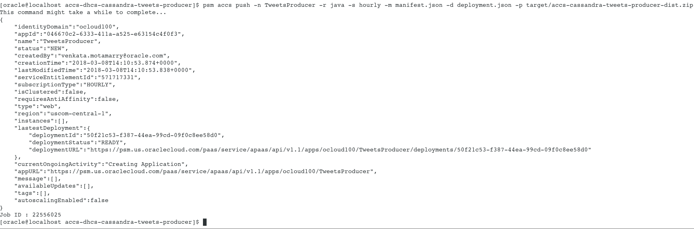

+ One can use the Job Id generated at the end of the previous deployment command to track the status of the Job.

	`psm accs operation-status -j <job id>`

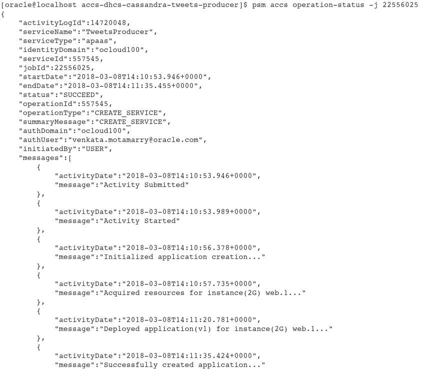

##### Artifacts for Tweets Query Service #####

+ Sample deployment.json for the Tweets Query Service App. Fill in the values as per your environment(s)

	`{`

	`"instances":1,`

	`"memory":"2G",`

	`"environment": {`
	
	`"DHCS_USER_NAME":"admin",`
	
	`"DHCS_USER_PASSWORD":"Ach1z0#d",`
	
	`"DHCS_NODE_LIST":"129.150.66.74",`

	`"DHCS_CLIENT_PORT":"9042",`
	
	`"CASSANDRA_TWEETS_KEYSPACE":"tweetspace9464"`

	`}`
	
	`}`

+ Sample manifest.json for the Tweets Query Service App. No values to be changed here.

	 `{`
	
	`"runtime":{"majorVersion":"8"},`
	
	`"command":"java -jar accs-dhcs-cassandra-tweets-api.jar"`
	
	`}`

##### Deploy Tweets Query Service app #####

+ We shall be using the Oracle Public Cloud UI to deploy the App to ACCS. When we login and navigate to the ACCS home page, we should see the TweetsProducer app either being provisioned or completed

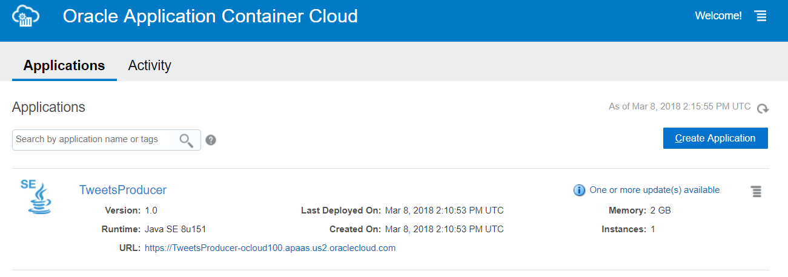

+ Click on Create Application and choose Java SE as the type that you want to create. Provide name for the instance (TweetsQueryService), manifest.json and deployment.json. Click on Create at the bottom.

If you don’t want to use UI, you can use the following PSM CLI command to create the ACCS app in this case

`psm accs push -n TweetsQueryService -r java -s hourly -m manifest.json -d deployment.json –p accs-dhcs-cassandra-tweets-api-dist`

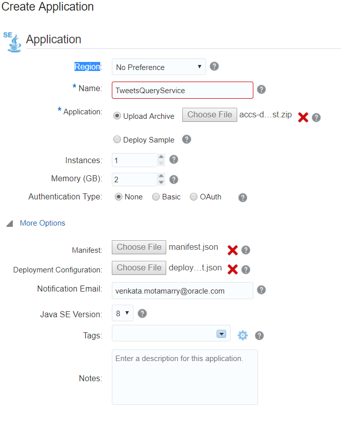

#### Verifying functionality ####

+ After both the apps have been deployed, navigate to their respective home pages to confirm that both are up and running and note down some key points
+ Click on the TweetsProducer app and navigate to its home page. Note down the App URL for the Producer app at the top of the page
 
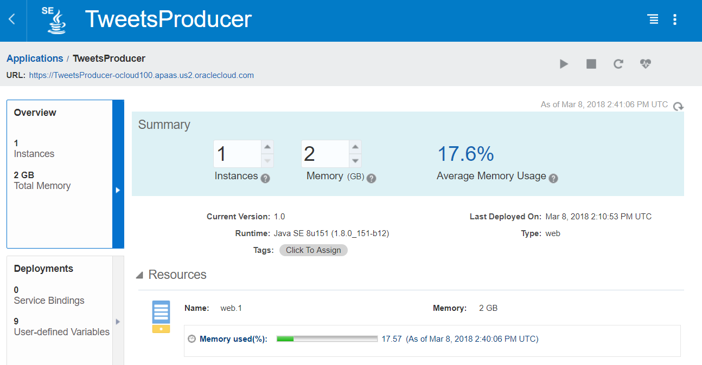
  
+ Start the Producer app using the PSM CLI Command. This should begin to load the tweets into the Cassandra DB.

`curl -X GET <tweet_producer_app_url>/tweets/producer` e.g. `curl -X GET https://TweetsProducer-ocloud100.apaas.us2.oraclecloud.com/tweets/producer`

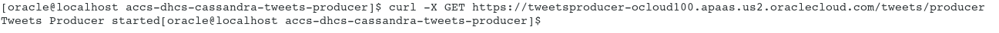

You can verify by logging into the Cassandra DB and querying the table `select * from tweets;`

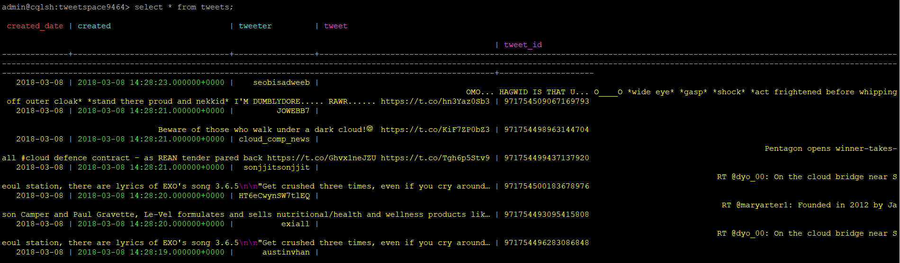

+ Click on the Tweets Query Service app and navigate to its home page. Note down the App URL for the app at the top of the page

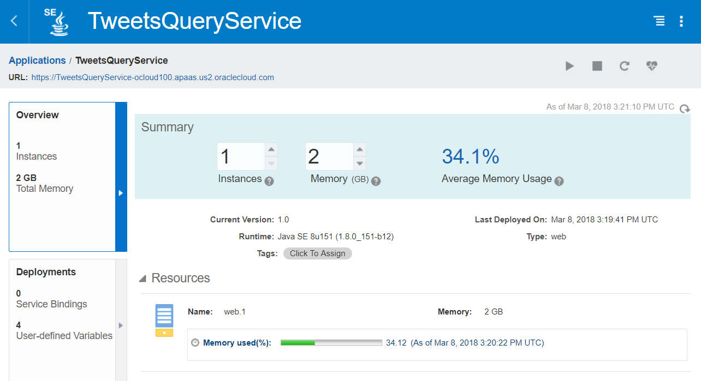

+ Use the Tweets Query service to query all the tweets.

`curl -X GET <tweets_query_app_url>/tweets` e.g. `curl -X GET https://TweetsQueryService-ocloud100.apaas.us2.oraclecloud.com/tweets/`

+ Use the Tweets Query service to query all the tweets on a given date.

`curl -X GET <tweets_query_app_url>/tweets/date/<date>` e.g. `curl -X GET https://TweetsQueryService-ocloud100.apaas.us2.oraclecloud.com/tweets/date/2018–03-08`

+ Use the Tweets Query service to query all the tweets by a particular tweeter.

`curl -X GET <tweets_query_app_url>/tweets/tweeter/<twitter id>` e.g. `curl -X GET https://TweetsQueryService-ocloud100.apaas.us2.oraclecloud.com/tweets/tweeter/anil9464`

+ Stop the producer app from loading more tweets into the Cassandra DB

`curl -X DELETE <app_url>/tweets/producer` eg `curl -X DELETE https://TweetsProducer-ocloud100.apaas.us2.oraclecloud.com/tweets/producer`

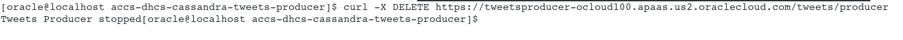
