---
# ORACLE Cloud-Native DevOps workshop #

## Build a Tweet analysis service on Oracle Public Cloud using Cassandra & Spring Data ##

### Introduction ###

This lab goes through the steps to use the Oracle Public Cloud to build a simple Tweet analysis service on Oracle Public Cloud using **Apache Cassandra**, **Spring Data** & **twitter4j**

### Background ###

Oracle Public Cloud now includes Data Hub Cloud Service which offers Apache Cassandra as a managed solution and Oracle Application Container Cloud Service that offers a polyglot, cloud native application development platform.

As part of this lab, a service (application) would be consuming a continuous stream of tweets (high velocity data) and persist it to the Data Hub Cloud. These tweets will be later queried from Data Hub Cloud using another service (application). The above-mentioned (micro) services are deployed to Oracle Application Container Cloud and they enjoy the native integration capability that this platform provides with Data Hub Cloud.

### Prerequisites ###

+ Valid credentials for an Oracle Cloud account
+ An active subscription to Oracle Application Container Cloud Service & Oracle Data Hub Cloud Service
+ The code is available on [GitHub](https://github.com/dvukmano/accs-cassandra-twitter-timeseries-app)
+ Twitter Account
+ A development environment (Java, Maven, Python, PSM CLI)

### Architecture ###

Here is high-level diagram to depict the solution

+ Tweet Producer is a Java app that uses the Twitter streaming API to consume tweets and push them to Cassandra cluster on Data Hub
	+ It’s a Java app and uses [twitter4j](http://twitter4j.org/en/) library to consume the tweet stream
	+ Applies user defined filter criteria/terms to filter relevant tweets from the stream
	+ Pushes the tweet data to Cassandra asynchronously
	+ It provides a REST API to start/stop the app on demand e.g. `/tweets/producer`

+ The Tweet Query service defines a REST API and interacts with Cassandra to fetch tweet data
	+ Its a basic [Spring Boot](https://projects.spring.io/spring-boot/) app which leverages [Spring Data](http://projects.spring.io/spring-data/) and Spring Web
	+ The [Cassandra module](https://projects.spring.io/spring-data-cassandra/) in Spring Data is used to interact with Cassandra
	+ `spring-boot-starter-web module` is used to expose a REST API to query tweet related info

+ Application Container Cloud provides out-of-the-box Service Binding for Data Hub Cloud (if both the services are in the same identity domain). This gives your app a secure communication channel without you having to do anything explicitly and no port related configuration is required at the database infrastructure level. Since in our GSE environment we do not have Data Hub Cloud Service we will use DHCS on another cloud account, all participants will use the same DHCS where they will create their own schema.

Here is how the Cassandra data model looks like

	`tweeter` - the twitter screen name e.g. vmotamar
	`tweet`  - the tweet itself (string format)
	`tweet_id` - the ID of the tweet
	`created` - the time stamp format of when the tweet was created
	`created_date` - the date in text format e.g. 2018–01–01

This table is meant to store tweets in time series style — the primary key is designed keeping this requirement in mind. It consists of single partition key and clustering columns

`created_date` is the partition key that implies:

- it is used to determine the partition in which a particular tweet will land
- each partition will contain a day worth of tweets
- only this column can be used in the WHERE clause (unless you create a secondary index) of your query i.e. it allows you to search for all tweets for a particular day (you will see this in action later)

`create` and `tweeter` are clustering columns
	
- they determine how data is sorted on disk and returned in queries
- since `created` column is specified before `tweeter`, the tweet time stamp will be used for sorting (i.e. the latest tweet first) followed by the twitter screen name (alphabetical order)
- you can use the `tweeter` column in a `where` clause (as well) by adding `allow filtering` to the query

### Infrastructure setup steps ###

+ Setup a Cassandra cluster using Oracle Data Hub Cloud console and bootstrap Cassandra (keyspace and table). In this lab, the Cassandra cluster is already setup - you do not have to create one.
+ Create a Twitter app that provides us with the required authentication tokens
+ Prepare the code for deployment to Application Container Cloud Service considering the environment variables

#### Provision Cassandra on Oracle Data Hub Cloud ####

***Today in this lab, we will be using a pre-provisioned Data Hub instance.*** The details of the instance are available [here](https://github.com/dvukmano/learning-library/blob/master/workshops/cloud-native-devops-workshop/accs-dhcs-twitter/artifacts/dhcs-instance.md). Please note that the following steps in this section are only for your knowledge, you do not have to setup the Data Hub instance. 

+ Login to [Oracle Public Cloud](https://cloud.oracle.com/home). Navigate to Data Hub using the Dashboard or the Navigation Menu on the top left corner of the page.

+ Click on Create Instance and fill in the details on the next page. Important items to keep track of are the SSH Key and the Username / Password for the Cassandra Instance(s).

+ Here is an example of a basic single node cluster running Cassandra 3.11.1 

	The `Public IP` is the IP address of the VM on which the Cassandra instance is running. 

+ By default, SSH access to the Data Hub Instance is not enabled. To enable access, click on the menu item on the top right and select `Access Rules`.

+ `ora_p2cass_ssh` is disabled by default. click on the menu item on the right corner corresponding to this rule and `Enable` the rule. It will take a short amount of time for the rule to be enabled.

+ If we want to allow communication from internet to the Cassandra DB, then we will have to create a new Access Rule. Click on `Create Rule` and fill in the details as shown in figure below

#### SSH to the VM ####

***Today in this lab, we will be using a pre-provisioned keyspaces (tweetspace1 - tweetspace30).*** But you can try to connect and create your own keyspace.
+ A DHCS instance has already been provisioned for the lab. The instance details are available [here](artifacts/dhcs-instance.md), all the DHCS environment information that you would need to complete the lab and present in this file. Also the private key to SSH to the VM is available [here](https://github.com/dvukmano/learning-library/blob/master/workshops/cloud-native-devops-workshop/accs-dhcs-twitter/artifacts/PrivateKey.zip)

+ SSH as `opc` with the `privatekey `to the VM using the `IP address` from the previous step. You could use PuTTY or the SSH command. Further information [here](https://docs.oracle.com/en/cloud/paas/data-hub-cloud/user/connecting-cluster-node-secure-shell-ssh.html#GUID-16765BDA-5713-43C7-82D4-5EE62E31C481)
+ As `oracle` user, log into Cassandra using `cqlsh`
	+ `sudo su oracle`
	+ cqlsh -u admin \`hostname\`
	+ the password is the same as the DHCS Password that is mentioned [here](https://github.com/dvukmano/learning-library/blob/master/workshops/cloud-native-devops-workshop/accs-dhcs-twitter/artifacts/dhcs-instance.md)

#### Create a unique keyspace (already created tweetspace1 - tweetspace30) ####

Choose a unique name for your keyspace and create it. Let’s take `tweetspace9464` in this case to proceed. 

`CREATE KEYSPACE tweetspace9464 WITH REPLICATION = { 'class' : 'SimpleStrategy', 'replication_factor' : 1 };`

#### Create table to store tweets ####

Execute the following at the `cqlsh` prompt

- `USE tweetspace9464;` //switch to the appropriate keyspace
- `CREATE TABLE tweets (tweeter text,tweet_id text,tweet text,created timestamp,created_date text,PRIMARY KEY ((created_date), created, tweeter)) WITH CLUSTERING ORDER BY (created DESC);` //create the table
- `desc tweetspace9464;` //confirm

#### Create a Twitter app (Start doing steps frpom here) ####

+ We need a Twitter account. If you dont have already create one.
+ Once the Twitter account is ready, go to https://apps.twitter.com and create a new app. Provide the Name, Description and website values.

+ Once the app is created, change TAB and go to keys and access tokens section for the app. Note down the Consumer Key (API Key) and Consumer Secret (API Secret).

+ Click on ‘Create my Access token’ at the bottom of the screen and note down the Access Token & Access Token Secret values.

#### Build Application ####

+ Ensure that a development environment is available (Java & Maven should be installed and configured). Get in touch with the instructor for further queries. We will use Oracle Developer cloud Service (ODCS) capabilities to bild and deploy application.
+ Start by fetching the project from Github into Developer Cloud Service. You can continue to use existing Alpha Office project or create a new project 'TwitterLab'. To add a new repository, go to Project, click on '+ New Repository':
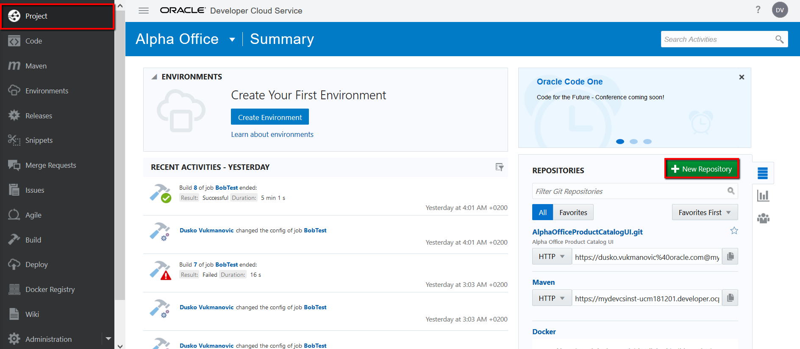

Enter name for repository: twitterlab and check 'import from existing repository' and link to repo existing repo is: https://github.com/dvukmano/accs-cassandra-twitter-timeseries-app, then click Create:
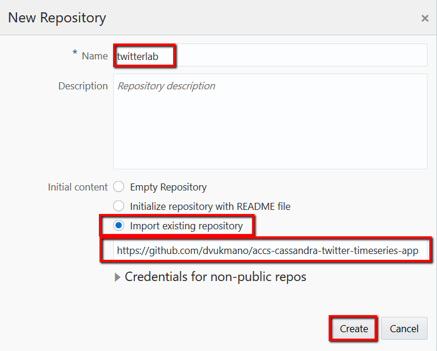

+ By default, the producer and query code is hard-coded to refer to `tweetspace` as the keyspace. This needs to be changed at both places to reflect the right keyspace value.
+ For the Tweet producer app, update the code to reflect the right keyspace. In this case, we are changing it to `tweetspace9464`

Modify the `keyspace` element of the `@Table` annotation in [TweetInfo.java](accs-dhcs-cassandra-tweets-producer/src/main/java/com/oracle/cloud/accs/dhcs/cassandra/producer/TweetInfo.java) present in the above downloaded code.
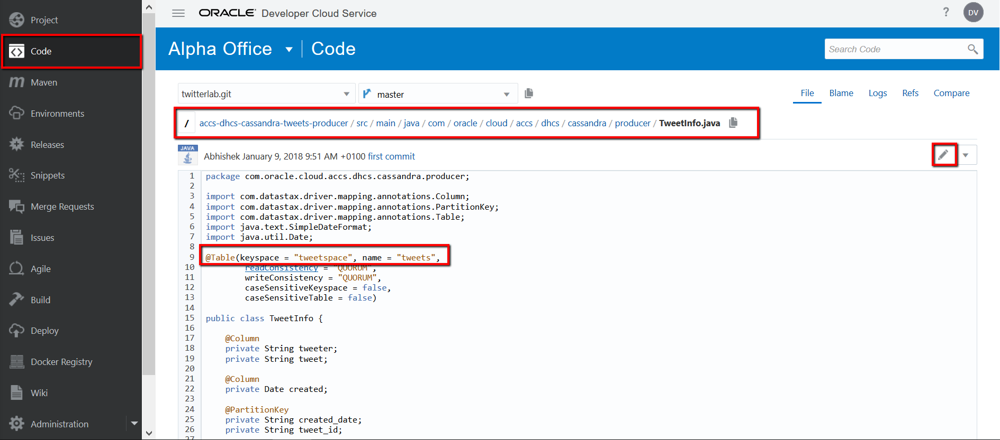

A new "pencil" icon let's you edit code in your private git repositories hosted in Developer Cloud Service directly in your browser. Once you edited the code, you can commit the changes to your branch directly providing commit messages.
	
	The updated line should read `@Table(keyspace = "tweetspace9464", name = "tweets",`

Update this line of code and click Commit, provide Commit message. 
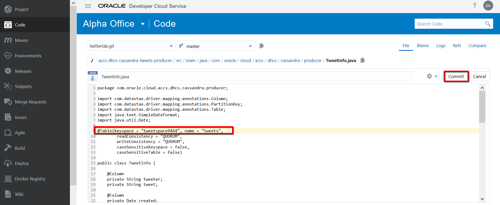

+ Build the Tweet Producer application with creating new Build job in ODCS (Oracle Developer CLoud Service). On the menu on the left side go to Build and click '+ New Job':
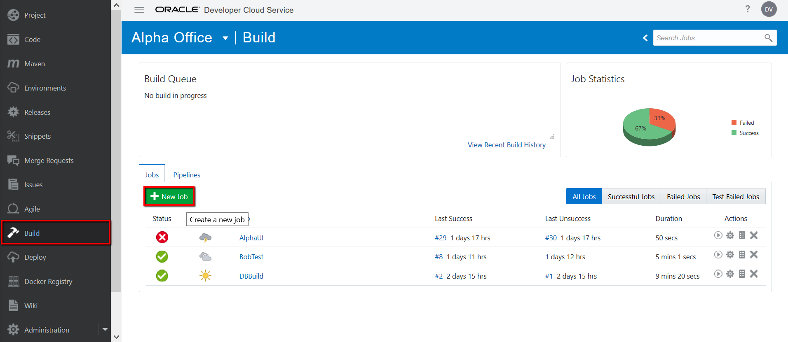

Enter Job Name (tweetsproducer), choose Create New and Software Template is myLabTemplate, click Create Job:
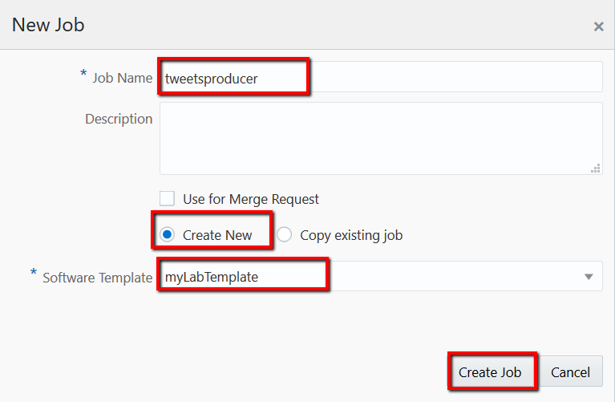

Add git repository, click on 'Add Source Control', select Git and choose twitterlab.git repository.
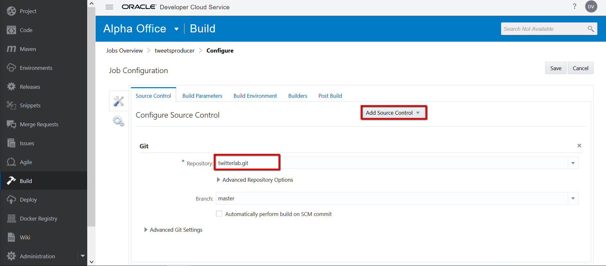

Go to tab Builders and add Maven Builder, POM file is 'accs-dhcs-cassandra-tweets-producer/pom.xml'
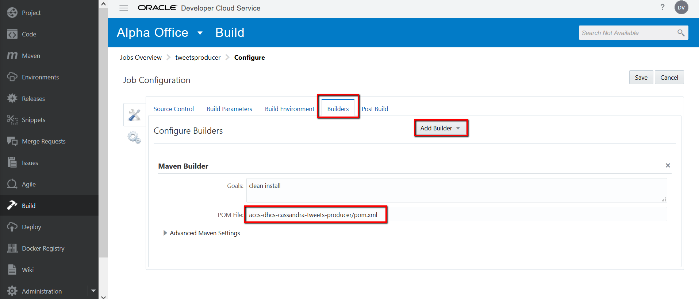

Go to Post Build and add Artifact Archiver, Files to archive: `**/target/*.zip`
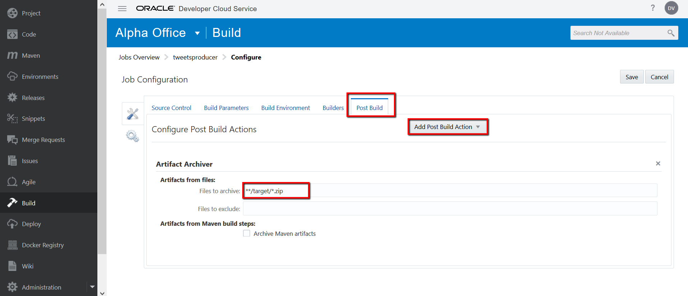

Save your Build job and click Build Now. The build process will create `accs-cassandra-tweets-producer-dist.zip` in the target directory.

+ For the Tweets Query Service, you can use the `CASSANDRA_TWEETS_KEYSPACE` environment variable to specify the keyspace (details in the next section)

+ Using the same steps create Build job for the Tweets Query Service. Job name could be `tweetsquery`, POM file `accs-dhcs-cassandra-tweets-api/pom.xml`. Do not forget to add Post Build step and Artifact Archiver, Files to archive **/target/*.zip

+ The build job will create `accs-dhcs-cassandra-tweets-api-dist.zip` in the target directory.

#### Application Deployment to ACCS ####

+ To deploy the application to ACCS, you will need two more artifacts (deployment.json & manifest.json) for each of the services. The contents of both of them will be different for the Tweets Producer app and Tweets Query Service. The github code does have a sample for the two .json files but they need to be modified to suit our purpose.

##### Artifacts for Tweets Producer app #####

+ An important point to note is, the Data Hub Cloud Service (Cassandra instance) is hosted in a different identity domain than the one that will be hosting the ACCS instances. Hence, the out of box service binding between ACCS and DHCS cannot be utilized. Explicit references must be made as environment variables. Do not use the deployment.json file from GitHub as is, it has to be modified along the values mentioned below. 
+ Sample deployment.json for the Tweets Producer App. Fill in the values as per your environment(s) using ODCS edit capability.
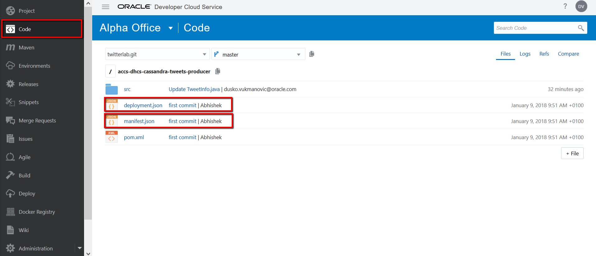

	`{`
	
	`"instances":1,`
	
	`"memory":"2G",`
	
	`"environment": {`
	
	`"TWITTER_CONSUMER_KEY":"<as per your setup>",`
	
	`"TWITTER_CONSUMER_SECRET":"<as per your setup>",`
	
	`"TWITTER_ACCESS_TOKEN":"<as per your setup>",`
	
	`"TWITTER_ACCESS_TOKEN_SECRET":"<as per your setup>",`
	
	`"TWITTER_TRACKED_TERMS":"nosql,cloud",`
	
	`"DHCS_USER_NAME":"<Cassandra DB User Name>", `
	
	`"DHCS_USER_PASSWORD":"<Cassandra DB password>", `
	
	`"DHCS_NODE_LIST":"<IP Address of Cassandra DB VM>",` 
	
	`"DHCS_CLIENT_PORT":"9042"`
	
	`}`
	
	`}`
+ Sample manifest.json. You can use the same one that has been downloaded from GitHub. No values are to be changed here.

	`{`
	
	`"runtime":{"majorVersion":"8"},`
	
	`"command":"java -jar accs-cassandra-tweets-producer.jar"`
	
	`}`

##### Deploy Tweet Producers app #####

+ Using ODCS Deploy capability create new configuration to deploy Tweets Producer as an ACCS instance. Go to Deploy on the menu and create new deployment configuration.

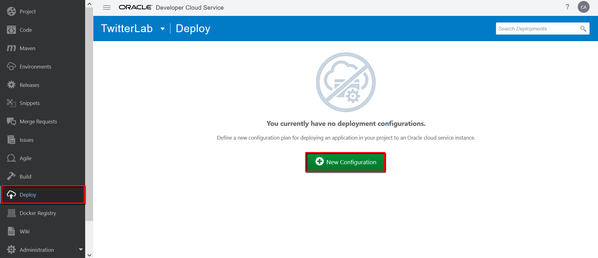

Fulfill following attributes:

Configuration Name: tweetsproducer

Application Name: TweetsProducer

Type: Automatic - Deploy stabile builds only

Job: tweetsproducer

Artifact: accs-dhcs-cassandra-tweets-producer/target/accs-cassandra-tweets-producer-dist.zip

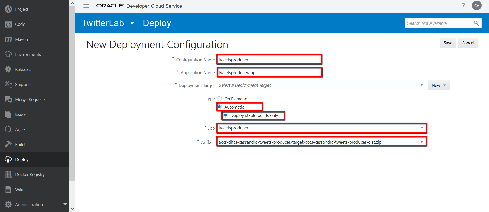

Create new deployment target, click on New and select Application Container Cloud...

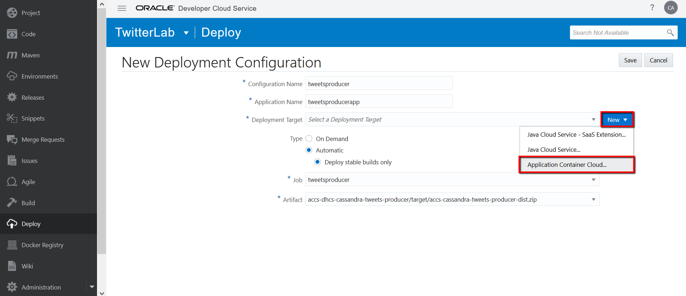

Complete the data about Application Container Cloud Service (you can find information on ACCS overview page) and click Test Connection, then Use connection.

Complete ACCS properties, Runtime - Java and Subscription - Hourly. Open another ODCS project window; go to Code and copy/paste deployment.json ACCS Deployment into and manifet.json into ACCS manifest. Save deployment configuration.

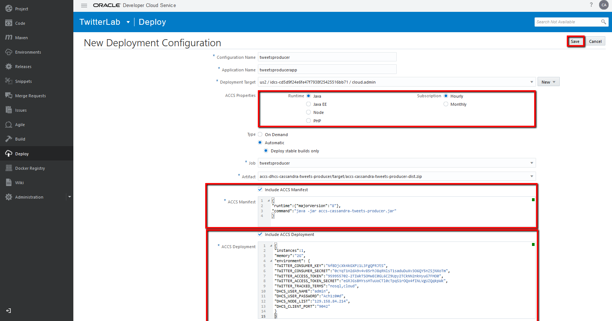

Now click on Start to deploy application to ACCS.

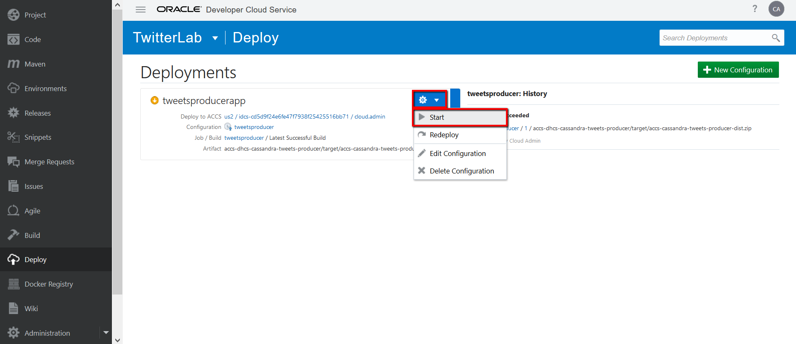

##### Artifacts for Tweets Query Service #####

Using the same steps now prepare and deploy Tweets Query Service App. Go to Code on ODCS menu and find deplyment.json and manifest.json in 'accs-dhcs-cassandra-tweets-api' folder.

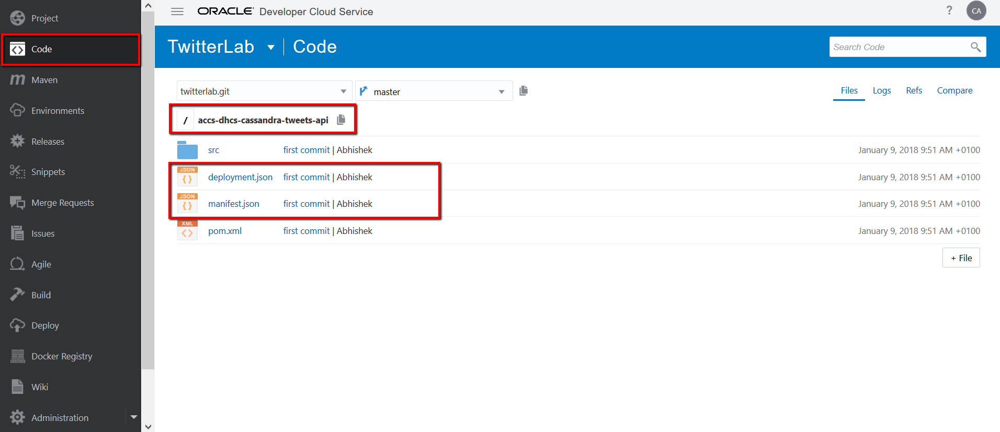

+ Sample deployment.json for the Tweets Query Service App. Fill in the values as per your environment details specified [here](https://github.com/dvukmano/learning-library/blob/master/workshops/cloud-native-devops-workshop/accs-dhcs-twitter/artifacts/dhcs-instance.md)

	`{`
	`"instances":1,`
	`"memory":"2G",`
	`"environment": {`
	`"DHCS_USER_NAME":"<Cassandra DB User Name>",`
	`"DHCS_USER_PASSWORD":"<Cassandra DB password>",`
	`"DHCS_NODE_LIST":"<IP Address of Cassandra DB VM>",`
	`"DHCS_CLIENT_PORT":"9042",`
	`"CASSANDRA_TWEETS_KEYSPACE":"<Keyspace as specified by you, tweetspace9464 in this case>"`
	`}`
	`}`

+ Sample manifest.json for the Tweets Query Service App. You can use the same one that has been downloaded from GitHub. No values are to be changed here.

	 `{
	   "runtime":{"majorVersion":"8"},
	   "command":"java -jar accs-dhcs-cassandra-tweets-api.jar"
	 }`

##### Deploy Tweets Query Service app #####

Again, using the same steps create deployment configuration for tweetsqueryapp and deploy. You already have defined Deployment target.

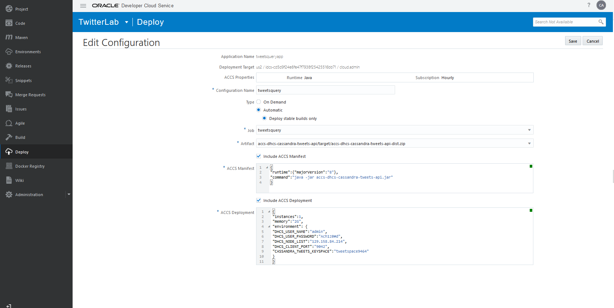

#### Verifying functionality ####

+ After both the apps have been deployed, navigate to their respective home pages to confirm that both are up and running and notice the App URL

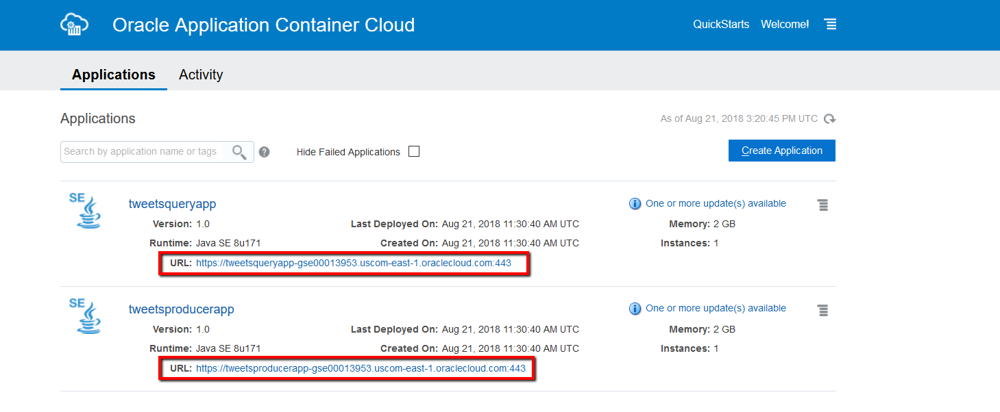

+ Start the Producer app using the app URL, click on URL and this will open new browser tab, append `/tweets/producer` on URL and press Enter. This should begin to load the tweets into the Cassandra DB.

Instead of ACCS console, you can use curl to start the Producer app.

`curl -X GET <tweet_producer_app_url>/tweets/producer` e.g. `curl -X GET https://tweetsproducerapp-gse00013953.uscom-east-1.oraclecloud.com/tweets/producer`

You can verify by logging into the Cassandra DB and querying the table `select * from tweets;`

+ With the same steps, click on the Tweets Query Service app URL and in new browser tab append `/tweets` on URL and press Enter. This should give you .json response with all the tweets.

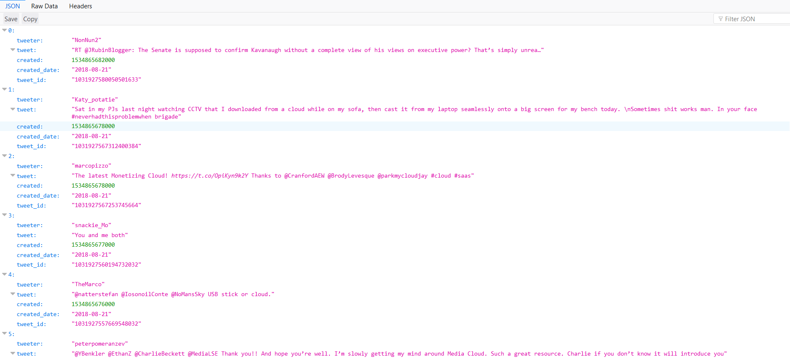

+ Use the Tweets Query service with curl to query all the tweets.

`curl -X GET <tweets_query_app_url>/tweets` e.g. `curl -X GET https://tweetsqueryapp-gse00013953.uscom-east-1.oraclecloud.com/tweets`

+ Use the Tweets Query service to query all the tweets on a given date. From the list of tweets mentioned above choose a date and use it in the filter below, you cal also use browser with the same syntax

`curl -X GET <tweets_query_app_url>/tweets/date/<date>` e.g. `curl -X GET https://tweetsqueryapp-gse00013953.uscom-east-1.oraclecloud.com/tweets/date/2018–08-30`

+ Use the Tweets Query service to query all the tweets by a particular tweeter. From the list of tweets mentioned above choose a twitter id and use it in the filter below

`curl -X GET <tweets_query_app_url>/tweets/tweeter/<twitter id>` e.g. `curl -X GET https://tweetsqueryapp-gse00013953.uscom-east-1.oraclecloud.com/tweets/tweeter/VamsiTalksTech`

+ Stop the producer app from loading more tweets into the Cassandra DB with curl, or go to ACCS console and stop application.

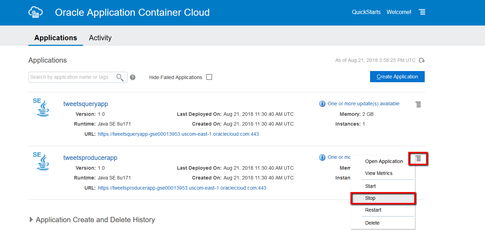

`curl -X DELETE <app_url>/tweets/producer` eg `curl -X DELETE https://tweetsproducerapp-gse00013953.uscom-east-1.oraclecloud.com/tweets/producer`

