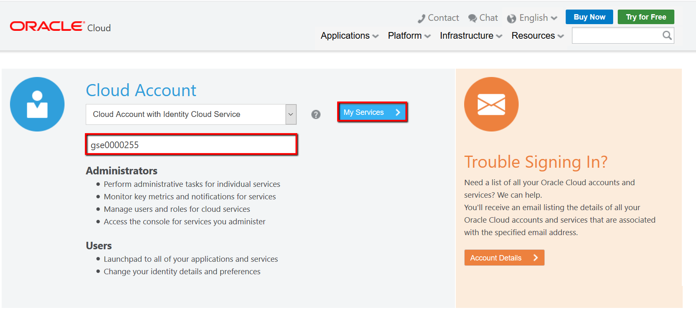
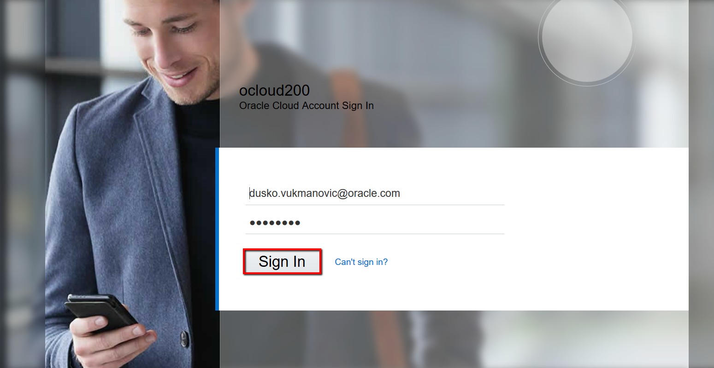
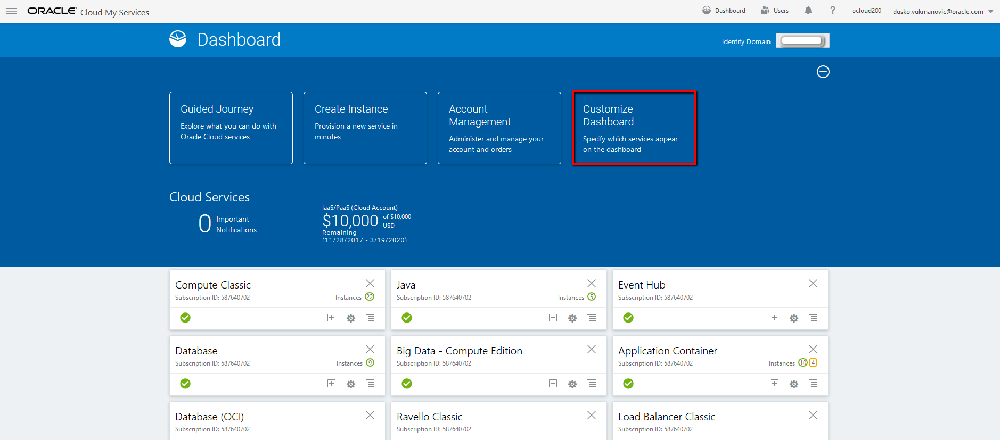

# ORACLE Cloud-Native DevOps workshop #
-----
## Sign In to Oracle Cloud ##

1. Open a browser and go to [cloud.oracle.com](https://cloud.oracle.com). Click **Sign In**.

2. Newer Cloud Accounts are already provisioned with Identity Cloud Service, enter the name of your Cloud Account and click **My Services**.

3. Enter username and password of user. Click **Sign In**.

4. On the Dashboard there are predefined tiles for different services. If the shortcut doesn't appear for a service click **Customize Dashboard** and mark the service to show on the dashboard. Notice that some services have "Classic" in the name and some have "OCI".

