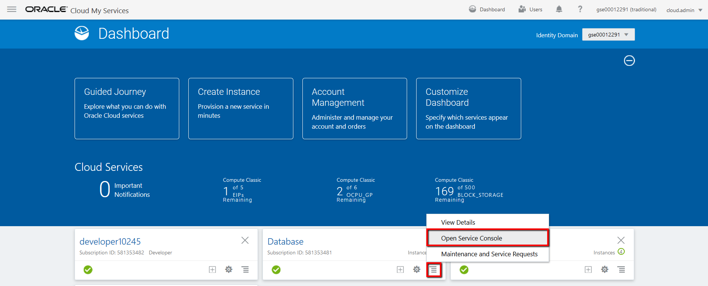
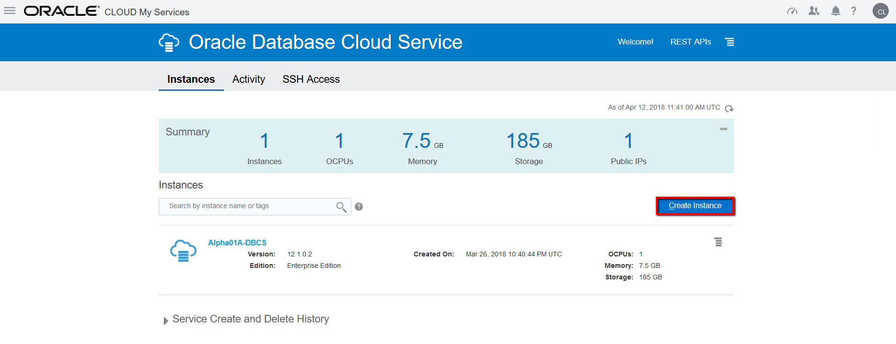
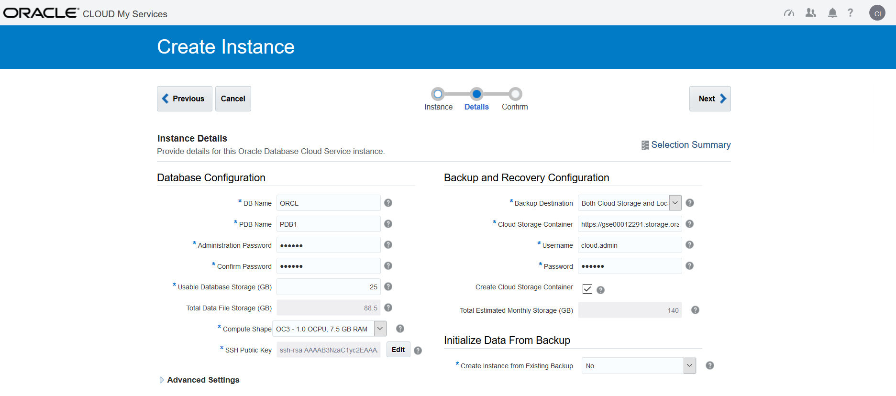
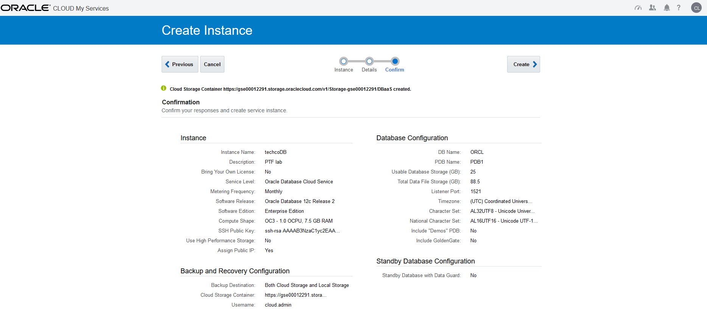
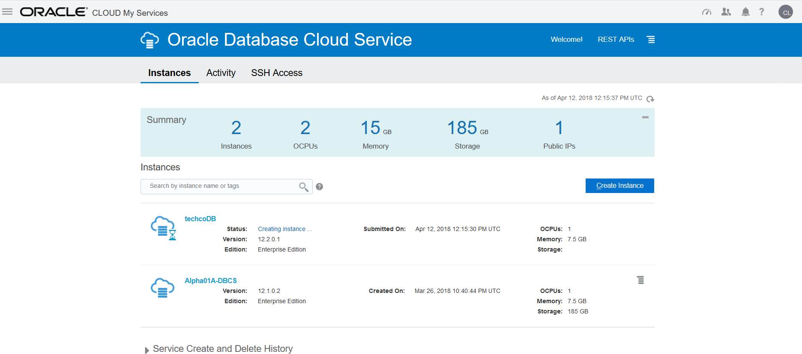

---
# ORACLE Cloud-Native DevOps workshop #
-----
## Create Database Cloud Service instance using user interface ##

### Introduction ###

Oracle Database Cloud Service provides you the ability to deploy Oracle databases in the Cloud, with each database deployment containing a single Oracle database. You have full access to the features and operations available with Oracle Database, but with Oracle providing the computing power, physical storage and (optionally) tooling to simplify routine database maintenance and management operations.

When you create database deployments, Database Cloud Service creates compute nodes to host the database, using computing and storage resources provided by Oracle Compute Cloud Service. Additionally, it provides access to the compute nodes (and thus to the database) using networking resources provided by Oracle Compute Cloud Service.

### About this tutorial ###
This tutorial demonstrates how to:
	
+ create Database Cloud Service using the user interface.

### Prerequisites ###

- Oracle Public Cloud Service account including Database and Storage Cloud Service

### Steps ###

[Sign in](../common/sign.in.to.oracle.cloud.md) to [https://cloud.oracle.com/sign-in](https://cloud.oracle.com/sign-in). First select your datacenter then provide the identity domain and credentials. After a successful login you will see your Dashboard. On the dashboard click the hamburger icon on the Database tile. Select **Open Service Console**.

This is the Database Cloud Service Console page. To create new instance click **Create Instance** button.

The following parameters have to be provided:
+ **Instance Name**: the name of the service instance e.g. techcoDB.
+ **Description**: any description for your service.
+ **Notification Email**: optional parameter, provisioning status update(s) will be sent to the specified e-mail.
+ **Region**: a region where your instance will be provisioned, it depends on data region for your cloud account, you can leave 'No preference' and instance will be created in default region for your cloud account.
+ **Service Level**: Oracle Database Cloud Service.
+ **Metering Frequency**: Monthly. For more details about subscription types see the [documentation](https://docs.oracle.com/cloud/latest/dbcs_dbaas/CSDBI/GUID-F1E6807A-D283-4170-AB2B-9D43CD8DCD92.htm#CSDBI3395).
+ **Software Release**: Oracle Database 12c Release 2.
+ **Software Edition**: Enterprise edition.
+ **Database Type**: Single Instance.

The Instance Details page is the Service Details page. The following parameters have to be provided:
	
+ **DB Name (SID)**: container database service identifier.
+ **PDB Name**: pluggable database service identifier. You can leave the default PDB1
+ **Administrator Password**: database instance's system password. Don't forget to note the provided password.
+ **Usable database Storage (GB)**: You can leave the default 25
+ **Compute Shape**: number of OCPU and size of the RAM. Choose the smallest (default) one, OC3.
+ **SSH Public Key**: public key which will be uploaded to the VM during the creation. It allows to connect to the VM through ssh connection using the private key. When you click on buton 'Edit' you will have option to generate keypairs with select Create a New Key option and download the newly generated keypair for later usage. Download the generated keypairs zip file to your local folder and unzip for later usage.
 
If you want to use Putty to connect to VM than you will have to convert generated private key to Putty format. If you are using ssh utility on Linux than before using privateKey it is required to change the mode of the file to rw by owner only.

		$ [oracle@localhost cloud-utils]$  chmod 600 privateKey

+ **Backup Destination**: Leave default; Both Cloud and Local Storage
+ **Cloud Storage Container**: URL of the Oracle Storage Cloud Service container for your service instance backups. The format is the following: https://IDENTITYDOMAIN.storage.oraclecloud.com/v1/Storage-IDENTITYDOMAIN/MyContainer. Replace the identitydomain value according to your environment and specify a container name. Container name is up to you. To identify the URL of your storage account, see the [documentation](https://docs.oracle.com/en/cloud/iaas/storage-cloud/cssto/accessing-object-storage-classic.html#GUID-221133EF-F408-4DCF-9BF7-7A1F12C3E8A6). If this container doesn't exist, use the provided checkbox to create it.
+ **Cloud Storage User Name and Password**: the credentials for storage. Usually it is the same what was used to sign in to Oracle Cloud Services.
+ **Create Cloud Storage Containers**: check in because the container does not exist what you specified above.

For more details about parameters see the [documentation](https://docs.oracle.com/cloud/latest/dbcs_dbaas/CSDBI/GUID-D4A35763-53ED-4FBB-97BF-0366F21B05E0.htm#CSDBI3401). Click **Next**.

The final page is the summary about the configuration before submit the instance creation request. Click **Create** to start the provisioning of the new service instance.

When the request has been accepted the Database Service Console page appears and shows the new instance. The instance now is in Maintenance mode. Click on Creating instance... to get more information about the status.

