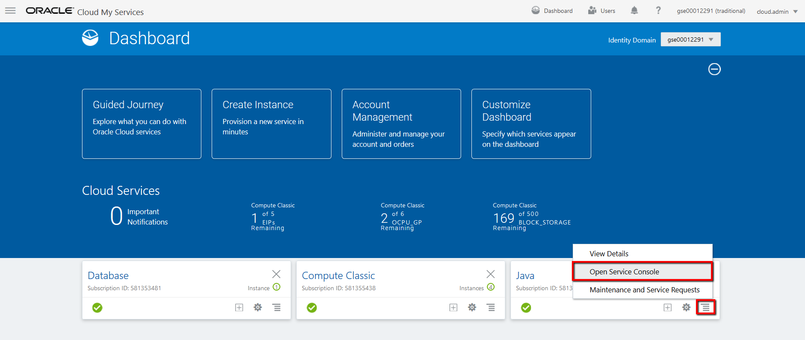
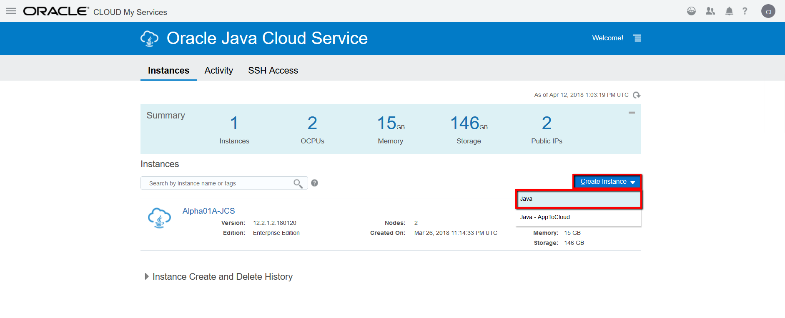
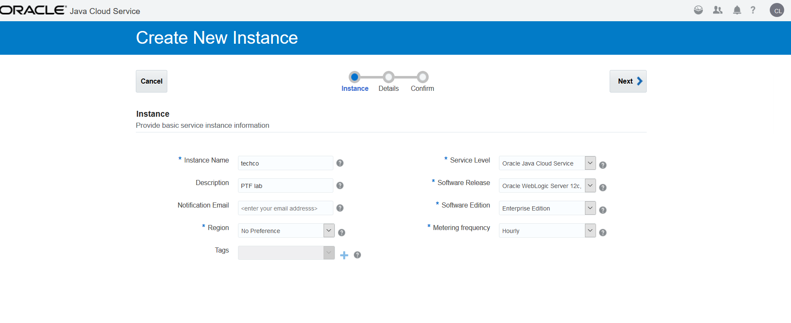
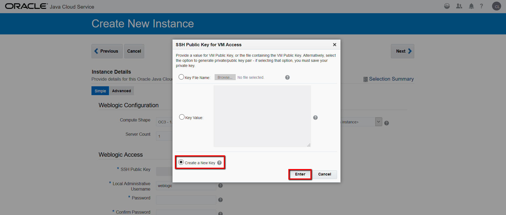
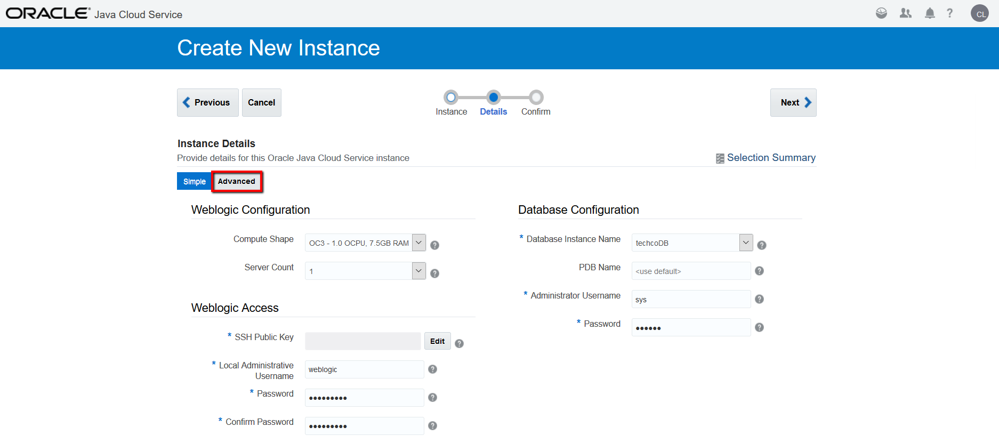
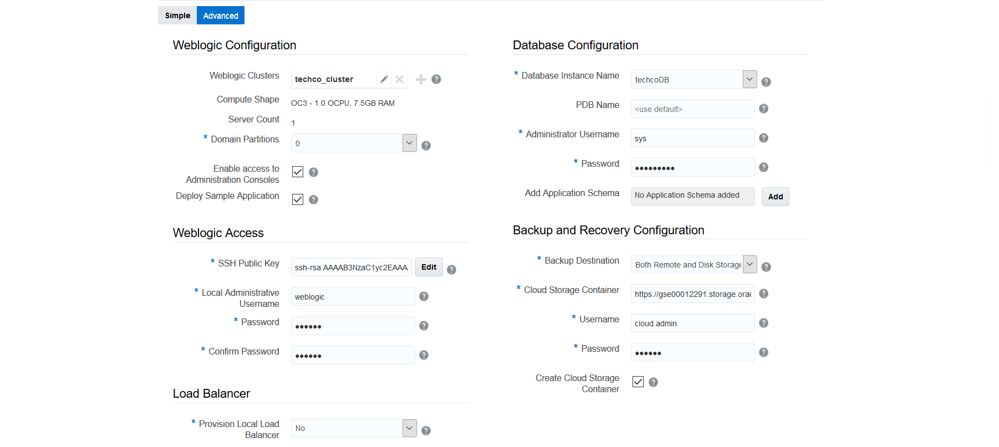
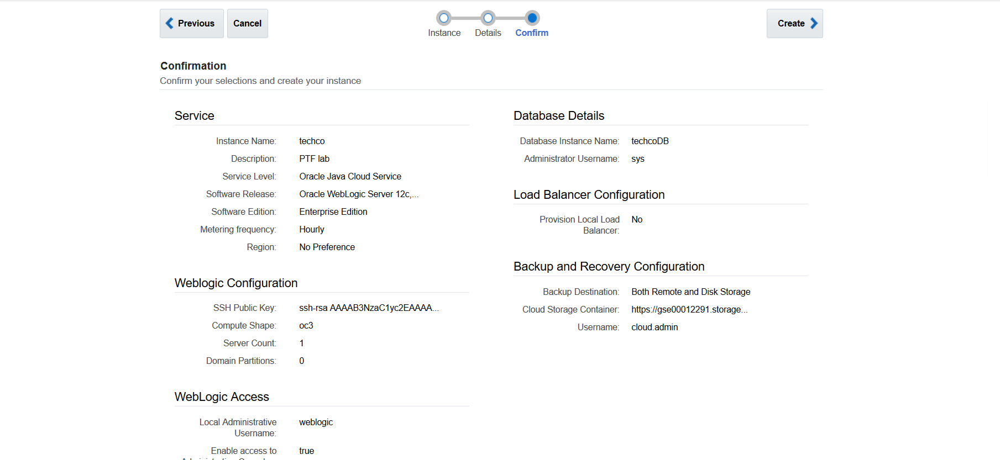
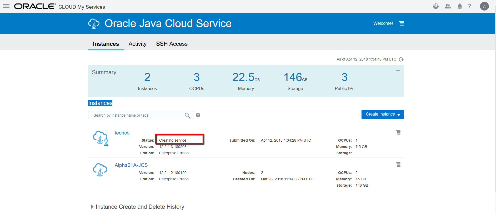

---
# ORACLE Cloud-Native DevOps workshop #

## Create Java Cloud Service instance using user interface ##

### Introduction ###

By using Oracle Java Cloud Service, you can quickly create and configure an Oracle WebLogic Server domain and set up your Java EE application environment without worrying about setting up any infrastructure or platform details yourself. All Oracle Java Cloud Service instances that you create are also preconfigured to use your database deployment in Oracle Database Cloud Service, and an object storage container that you create in your Oracle Storage Cloud Service.

### About this tutorial ###
This tutorial demonstrates how to:
	
+ create Java Cloud Service using the user interface.

### Prerequisites ###

+ Oracle Public Cloud Service account including Java, Database and Storage Cloud Service
+ Oracle Java Cloud Service uses Oracle Database Cloud Service to host the Oracle Fusion Middleware component schemas required by Oracle Java Required Files (JRF). Prior to creating an Oracle Java Cloud Service instance, [use your Oracle Database Cloud Service subscription to create a database deployment](../dbcs-create/README.md). As part of the instance creation process, Oracle Java Cloud Service provisions this database deployment with the Oracle JRF schemas.

### Steps ###

[Sign in](../common/sign.in.to.oracle.cloud.md) to [https://cloud.oracle.com/sign-in](https://cloud.oracle.com/sign-in). On the dashboard click the hamburger icon on the Java tile. Select **Open Service Console**.

This is the Java Cloud Service Console page. If this is the first time opening Java console then Welcome page will appear. In this case click **Go to Console** button.

To create new instance click **Create Instance** button and then Java.

The following parameters have to be provided:

+ **Instance Name**: the name of the service instance e.g. techco
+ **Description**: any description for your service.
+ **Notification Email**: optional parameter, provisioning status update(s) will be sent to the specified e-mail.
+ **Region**: a region where your instance will be provisioned, it depends on data region for your cloud account, you can leave 'No preference' and instance will be created in default region for your cloud account.
+ **Service Level**: Oracle Java Cloud Service.
+ **Software Release**: Oracle WebLogic Server 12c, 12.2.1.3.
+ **Software Edition**: Enterprise edition.
+ **Metering Frequency**: Hourly. For more details about subscription types see the [documentation](https://docs.oracle.com/cloud/latest/dbcs_dbaas/CSDBI/GUID-F1E6807A-D283-4170-AB2B-9D43CD8DCD92.htm#CSDBI3395).

The next input page is the Instance Details page, Simple. The following parameters have to be provided:
	
+ **Compute Shape**: number of OCPU and size of the RAM. Choose the smallest (default) one, OC3.
+ **Server Count**: number of managed servers in the cluster. Choose 1.
+ **SSH Public Key**: public key which will be uploaded to the VM during the creation. It allows to connect to the VM through ssh connection using the private key. When you click on buton 'Edit' you will have option to generate keypairs with select Create a New Key option and download the newly generated keypair for later usage. Download the generated keypairs zip file to your local folder and unzip for later usage.
 
If you want to use Putty to connect to VM than you will have to convert generated private key to Putty format. If you are using ssh utility on Linux than before using privateKey it is required to change the mode of the file to rw by owner only.

		$ [oracle@localhost cloud-utils]$  chmod 600 privateKey

+ **Local Administrative Username**: username of WebLogic administrator. For demo purposes you can use: weblogic
+ **Password**: WebLogic administrator's password. Don't forget to note the provided password.
+ **Database Configuration - Database Instance Name**: Database Cloud Service name to store WebLogic repository data. Basically the list populated with database services within the same identity domain.
+ **Database Configuration - PDB Name**: pluggable database service identifier of the Database Cloud Service instance -provided above- which will be used to store repository schema. If you have choosen default (PDB1) during Database Cloud Service creation then leave the default here too.
+ **Database Configuration - Administrator User Name**: DBA admin to create repository schema for Java Cloud Service instance. Enter: sys.
+ **Database Configuration - Password**: DBA admin password you provided during Database Cloud Service creation.

Now on the Instance Details page click on Advanced button. 

The following Advanced parameters have to be provided:

+ **Domain Partitions**: Create mutitenant instance. Select 1 to enable partitioning, you can leave default 0 for our example.
+ **Enable access to Administration Consoles**: because this instance will be available on public internet the default is that the WebLogic Admin console is not enabled. Do not forget to check in to get access to the Admin console.
+ **Deploy Sample Application**: deploy the sample application. It can be useful to test accessibility (correct LB configuration, etc.) of the Java Cloud Service Instance.
+ **Provision Load Balancer**: the save resources for sample application we will not create Load Balancer instance. Leave default: No
+ **Database Configuration - Add Application Schema**: It is an option to add different database service instance accessibility. For example different database used by the application and different for Java Cloud Service instance repository. You can configure later another Database Cloud Service, but here it is easier to define.
+ **Backup Destination**: Both Remote and Disk Storage.
+ **Cloud Storage Container**: URL of the Oracle Storage Cloud Service container for your service instance backups. The format is the following: https://IDENTITYDOMAIN.storage.oraclecloud.com/v1/Storage-IDENTITYDOMAIN/MyContainer. Replace the identitydomain value according to your environment and specify a container name. Container name is up to you. To identify the URL of your storage account, see the [documentation](https://docs.oracle.com/en/cloud/iaas/storage-cloud/cssto/accessing-object-storage-classic.html#GUID-221133EF-F408-4DCF-9BF7-7A1F12C3E8A6). If this container doesn't exist, use the provided checkbox to create it.
+ **Cloud Storage User Name and Password**: the credentials for storage. Usually it is the same what was used to sign in to Oracle Cloud Services.
+ **Create Cloud Storage Containers**: if the container defined above does not exist then check in.

For more details about parameters see the [documentation](https://docs.oracle.com/cloud/latest/jcs_gs/JSCUG/GUID-31F00F2C-221F-4069-8E8A-EE48BFEC53A2.htm#JSCUG-GUID-88BD737C-8DA9-419A-8DBF-489BDFF9C512). Click **Next**.

The final page is the summary page about the configuration before submit the instance creation request. Click **Create** to start the provisioning of the new service instance.

When the request has been accepted the Java Cloud Service Console page appears and shows the new instance. The instance now is in Maintenance mode. Click **Creating instance...** link to get more information about the status.

