---
# ORACLE Cloud-Native DevOps workshop #

## Create Java Cloud Service instance using user interface on Oracle Cloud Infractructure (JCS on OCI) ##

### Introduction ###

The Oracle Java Cloud Service (JCS) provides a cloud-based application server (Oracle WebLogic Server with automated customer-controlled provisioning, backup, patching, scaling with cloud tooling) designed to support any Java application. You may use the Oracle Java Cloud Service through the Oracle Java Cloud Service console and quickly create and configure Java EE application environment.

The Oracle Cloud Infrastructure (OCI) platform can run both Oracle workloads and cloud native applications, it offer highly available infrastructure ideal for enterprise applications and provide greater control over the network. This all adds up to great price-performance for Weblogic deployment.

### About this tutorial ###
This tutorial demonstrates how to:
	
+ Create Java Cloud Service based on OCI using the user interface.

### Prerequisites ###

+ Cloud Account with Oracle PaaS and IaaS Universal Credit subscription (includes an IDCS integrated OCI-Classic account and an OCI Account)
+ Oracle Java Cloud Service uses Oracle Database Cloud Service to host the Oracle Fusion Middleware component schemas required by Oracle Java Required Files (JRF).

### Steps ###

There are three major steps in order to setup JCS on OCI:
1. Perform pre-requisites for provisioning PaaS services on OCI
2. Provision DBCS service in OCI using PSM
3. Provision JCS service in OCI using PSM

#### 1. pre-requisites for provisioning PaaS services on OCI ####

[Sign in](../common/sign.in.to.oracle.cloud.md) to [https://cloud.oracle.com/en_US/sign-in](https://cloud.oracle.com/en_US/sign-in). 

After sign-in is successful, the My Services application opens. The Welcome section enables you to get started with activities that you would typically perform upon logging in to My Services. From the Customize Dashboard dialog box, you can control the tiles to be displayed on the dashboard. Notice that some service have "Classic" in the name and some have "OCI". Clicking on an OCI services redirects to OCI Console of Home region (Phoenix/Ashburn/Frankfurt).

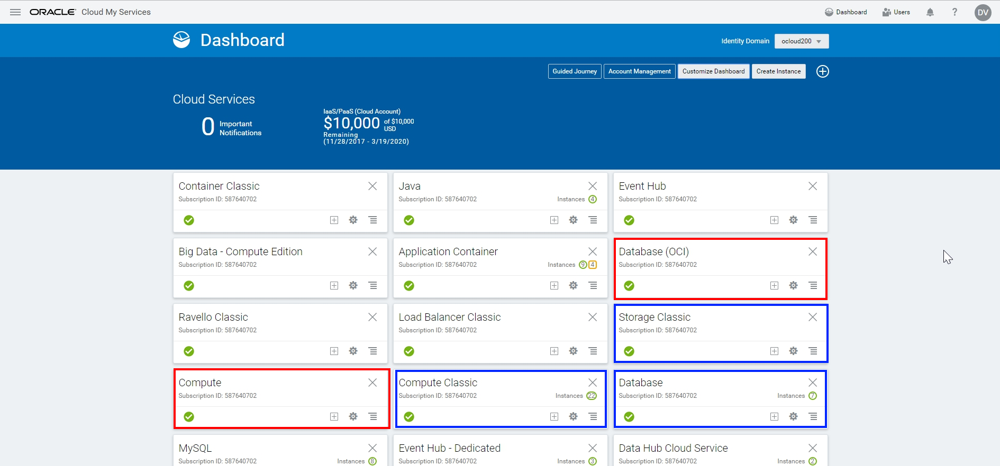

Go to Compute, click the hamburger icon, Open Service Console and log in to OCI console. Depends on how your account is set up you can use SSO or OCI account to log in. 

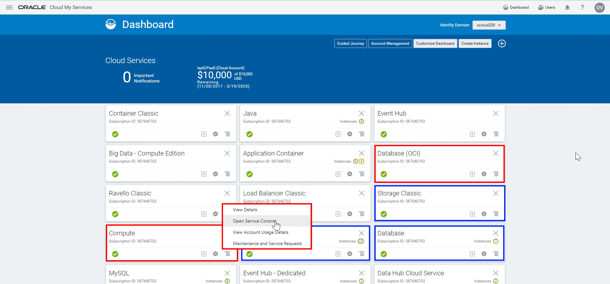

And here is OCI console where you can see your tenancy and default region and Oracle Cloud Identifier (OCID). 

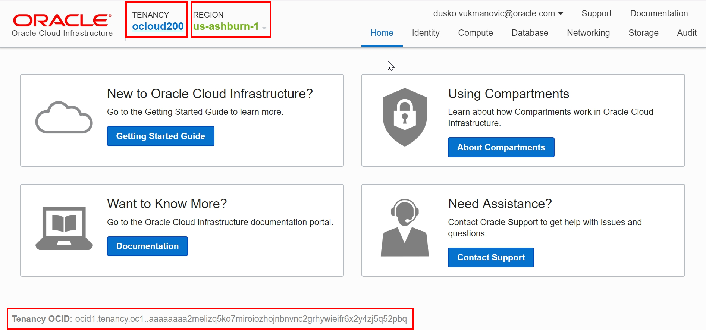

:information_source: Every Oracle Cloud Infrastructure resource has an Oracle-assigned unique ID called an Oracle Cloud Identifier (OCID). For PaaS provisioning, the OCI tenancy has an additional compartment and two policies provisioned by default. Compartment name is ManagedCompartmenForPAAS. One policy (PSM-mgd-comp-policy) is under  ManagedCompartmenForPAAS compartment. And second policy (PSM-root-policy)  is under root compartment.

##### 1.1. Create a Compartment #####
You can select an existing compartment to create the Oracle Cloud Infrastructure resources required for Java Cloud Service or create new one. For this tutorial, we'll crreate a new compartment, if you have one then you can skip this step.
:information_source: You cannot use ManagedCompartmenForPAAS and you cannot delete Compartments, but you can rename it.

Click **Identity**, and then click **Compartments**.

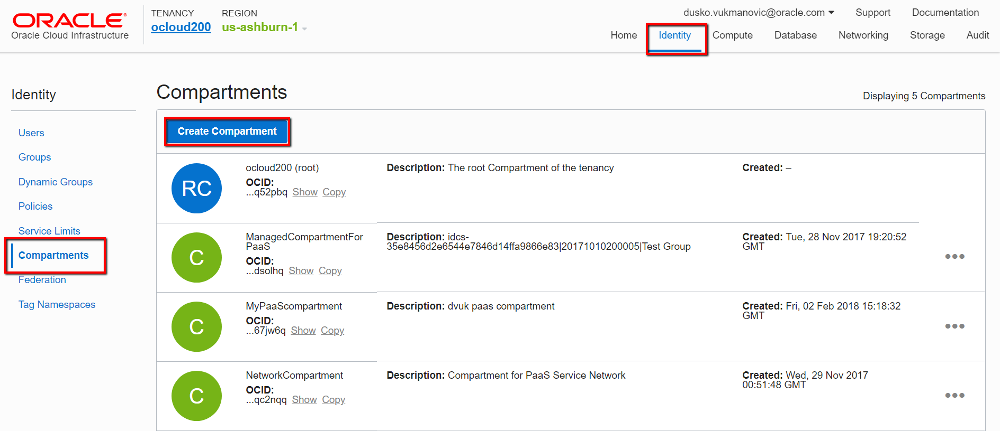

Enter a name and description for the new compartment, and click **Create Compartment**.

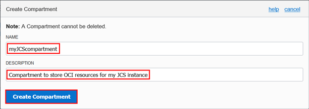

##### 1.2. Create a Virtual Cloud Network #####
In the Oracle Cloud Infrastructure web console, click **Networking**, :grey_exclamation: select the compartment that you created earlier, then **Virtual Cloud Networks**.
Click **Create Virtual Cloud Network**.

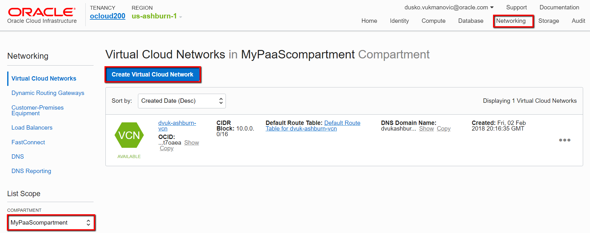

Enter a name for the Virtual Cloud Network, and let the service create a Virtual Cloud Network and related resources.

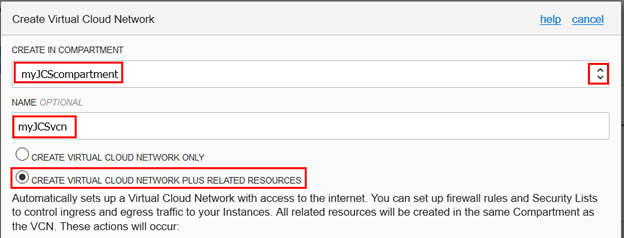

Scroll down, and click **Create Virtual Cloud Network**.

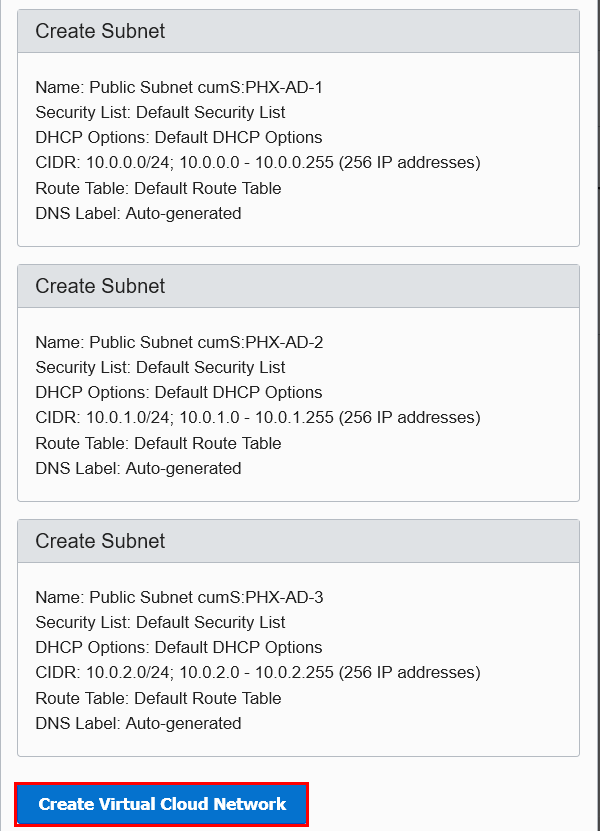

The service creates a Virtual Cloud Network with the CIDR 10.0.0.0/16 and one subnet per AD. CIDR - Classless Inter-Domain Routing is a method for allocating IP addresses and IP routing.
:memo: Note the name of the subnet you want to use for the Java Cloud Service instance.

##### 1.3. Permit Platform Services to Use the Virtual Cloud Network You Created #####

In the Oracle Cloud Infrastructure web console, click Identity and then Policies, check thatr your compartment is selected.
Click Create Policy.

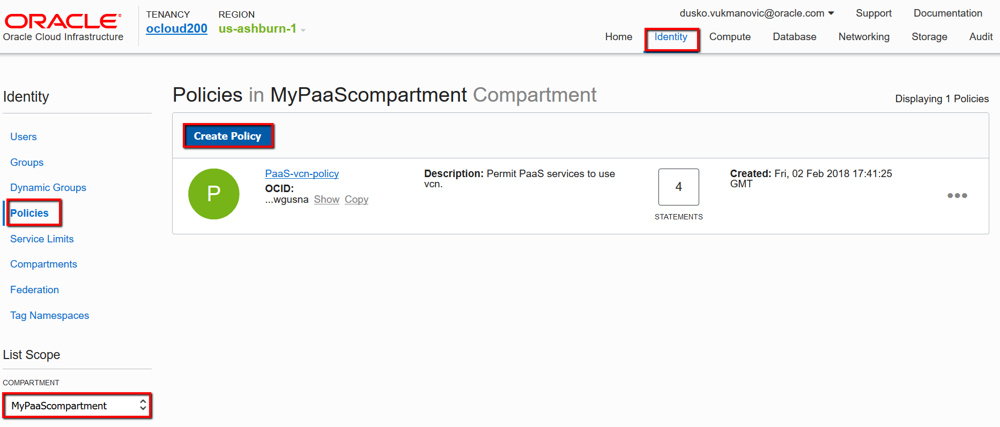

Enter a name and description for the policy.
In the Policy Versioning field, select Keep Policy Current to keep it current with any future changes to the definitions of policy verbs and resources. To limit access according to the definitions that were current on a specific date, select Use Version Date and enter that date in the YYYY-MM-DD format. 
Add the following policy statements, one at a time.

Remember to replace <compartment_name> with the name of the compartment you created earlier, MyPaaScompartment in this tutorial.

`Allow service PSM to inspect vcns in compartment MyPaaScompartment`

`Allow service PSM to use subnets in compartment MyPaaScompartment`

`Allow service PSM to use vnics in compartment MyPaaScompartment`

`Allow service PSM to manage security-lists in compartment MyPaaScompartment`

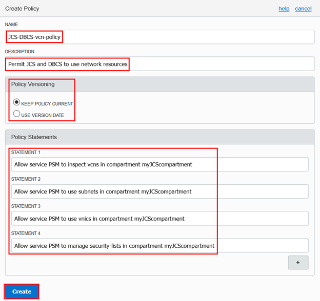

Click Create.

##### 1.4. Create an Object Storage Bucket #####
In the Oracle Cloud Infrastructure web console, click Storage and then Object Storage.
In the navigation pane on the left, select the compartment that you created earlier. Click Create Bucket.

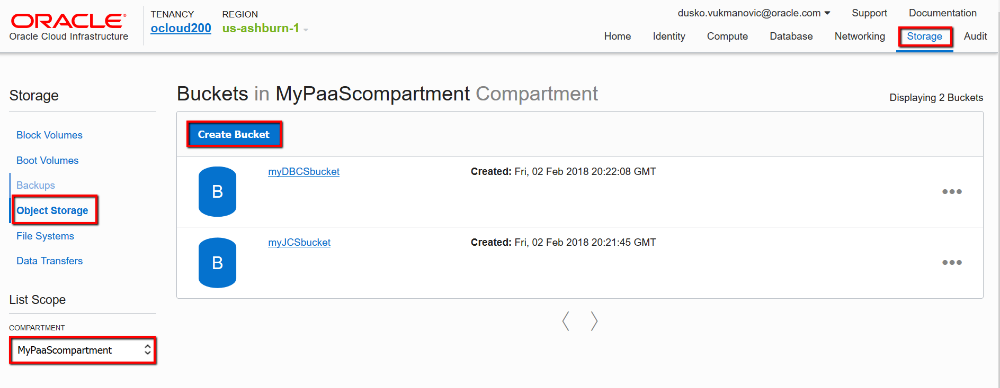

Enter a name for the bucket, and click Create Bucket. :memo: Note this name. You'll need it later while creating the Java Cloud Service instance.

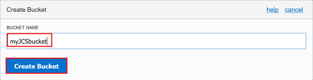

Also create bucket for DBCS.

##### 1.5. Generate a Swift password #####
In the Oracle Cloud Infrastructure web console, click your user name near the upper-right corner and click User Settings.

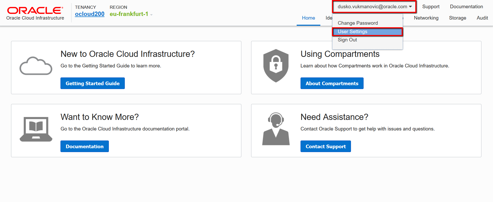

In the navigation pane on the left, click Swift Passwords.
Click Generate Password.
Enter a description for the password, and click Generate Password.

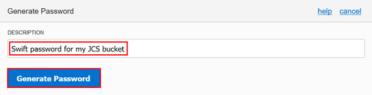

:memo: Copy and store the generated password. You'll need it later while creating the Java Cloud Service instance.

:information_source: Swift Password is used for Swift client to access Object Storage for the purposes of backing
up an Oracle Database System (DB System) database and JCS. OpenStack Object Storage (swift) is used for redundant, scalable data storage using clusters of standardized servers to store petabytes of accessible data. It is a long-term storage system for large amounts of static data which can be retrieved and updated.

#### 2. Provision DBCS service in OCI using PSM ####
Go back to OCI-C console, log into the My Services Dashboard, on the dashboard click on Database service and Select **Open Service Console** and on the service console, launch the provisioning wizard by clicking **Create Service**.

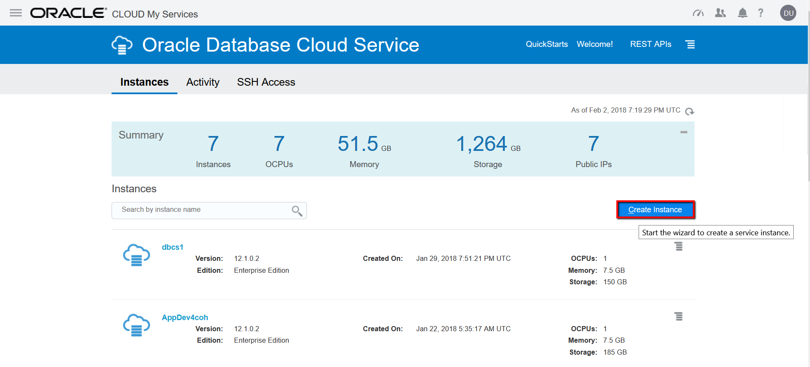

On the Instance page provide a name and description for the database deployment, and provide information about its high-level characteristics:

Instance Name: Alpha01A

Region: us-ashburn-1 (the same region in which you had created the OCI resources earlier)

Availability Domain: (The availability domain (within the region) where the database deployment will be placed.)

Subnet: QnsC:US-ASHBURN-AD-1 (select values based on the information you recorded while creating the infrastructure resources)

Software Release: Oracle Database 12c Release 2

Use the default values for the rest of the subscription details and click Next to move on to the Wizard's service details page.

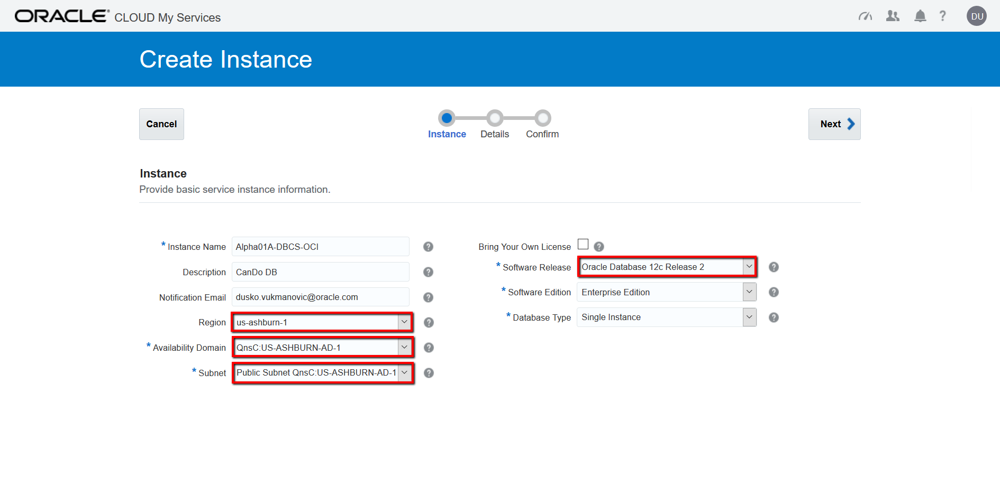

On the Details page provide following information:

Create and confirm an Administration password: Ach1z0#d (you can use when you need to access the database)

Compute shape: VM.Standard1.1 (shape that will meet your load and processing requirements)

SSH public key: click Edit to open the Public Key Access for VM dialog box and click "Create a New Key" and Enter, then click on Download button to save the key pair on your laptop and Done, and the Public key has been inserted. (provides authentication when connecting to a node in my instance through a Secure Shell client)

Backup destination: Both Cloud Storage and Local Storage

Cloud Storage Container: https://swiftobjectstorage.us-ashburn-1.oraclecloud.com/v1/gse0000255/myDBCSbucket (URL for the object storage bucket you created as one of your infrastructure resources, https://swiftobjectstorage.REGION.oraclecloud.com/v1/NAMESPACE/CONTAINER, the variables in that format are the region, tenant, & bucket, REGION = us-ashburn-1, NAMESPACE = tenant/cloud account, CONTAINER = bucket name)

Now enter your username and the swift password you generated earlier, then accept the remaining defaults and click Next.

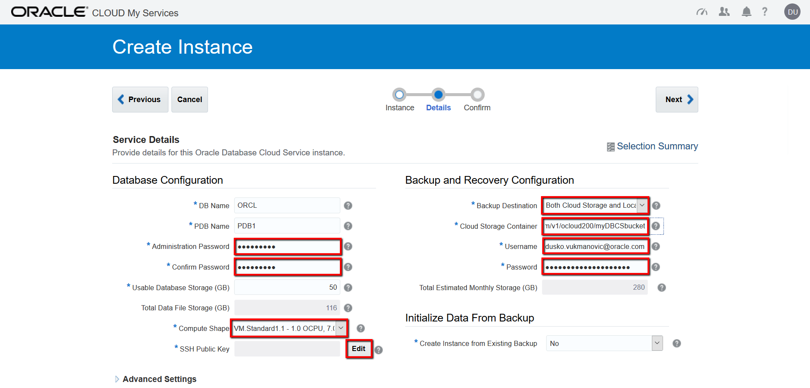

You can verify the details on Confirm page and click Create.

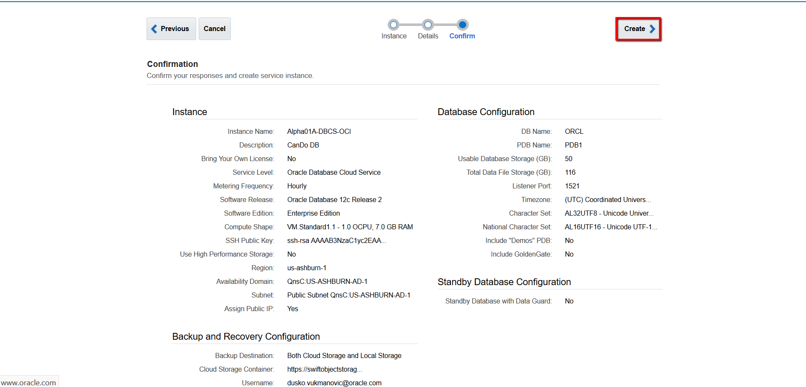

In a moment, your new service will appear on the DBCS console. You can track provisioning progress in the Service Create and Delete History panel, simply by clicking Details.

And I can see that my service instance has been successfully provisioned.

Picture??

#### 3. Provision JCS service in OCI using PSM ####

As with my database instance, before provisioning the Java Cloud Service instance, I'll need to have following information available:
The availability domain
The subnet name, which must be part of the same VCN that I created earlier with the other OCI resources.
The object storage bucket name
And the swift password

From the action menu for my JCS account, I'll select Open Service Console...
...and on the service console click Create Service and from the drop-down control select Oracle Java Clooud Service.

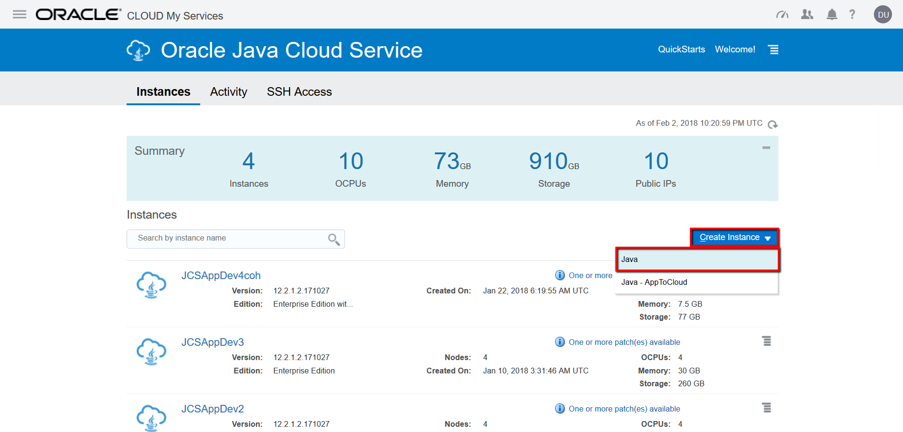

First, on the basic service information page, I'll give my Java Cloud Service instance a name... 
	
...and select the region from the drop-down list. This should be the same region that I created the OCI resource and DBCS deployment in.

As with the database service instance, selecting the region spawns the availability domain and the subnet fields.

I'll select values for these fields, based on the information I recorded while creating the infrastructure resources.

First, I'll select a compute shape that will meet my load and processing requirements. Note that I can only select an Oracle Cloud Infrastructure compute shape. 

Next, I'll insert an SSH public key, which provides authentication when connecting to a node in my instance through a Secure Shell client.

I'll click Edit to open the Public Key Access for VM dialog box..

...and here click Browse to open my local file system

I'll select a public key.

And then click Enter
And the Public key has been inserted.
Now, I'll select Enable Access to Administration Consoles so that I can access consoles such as WebLogic Server or Fusion Middleware from within the service instance

Next, I'll create and confirm an Administration password, which I can use when I need to access the database administration console.

I'll now select the database instance a created in the earlier exercise...

...and enter the appropriate username and password.

For the For the Backup Destination, I'll first select Both Remote and Disk Storage, which will spawn three new data fields:

Cloud Storage Container

Username

and Password

For my Cloud Storage Container, I'll enter the URL for the object storage bucket I created as one of my infrastructure resources. This can be a rather long entry, since I need to enter the full URL in this fixed format.

The variables in that format are the region, tenant, & bucket. This is why I made sure to copy the name after I created the bucket.

Now, I'll enter my username and the swift password I generated earlier...

... then accept the remaining defaults and click Next.

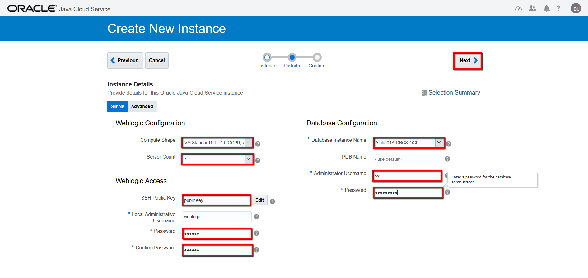

Advanced options - LB:

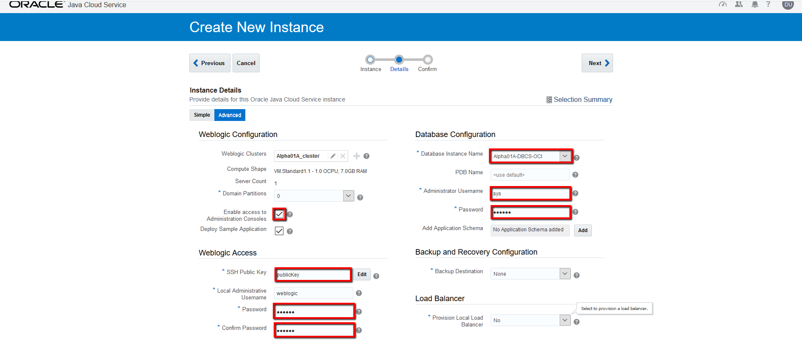

Advanced options + LB:

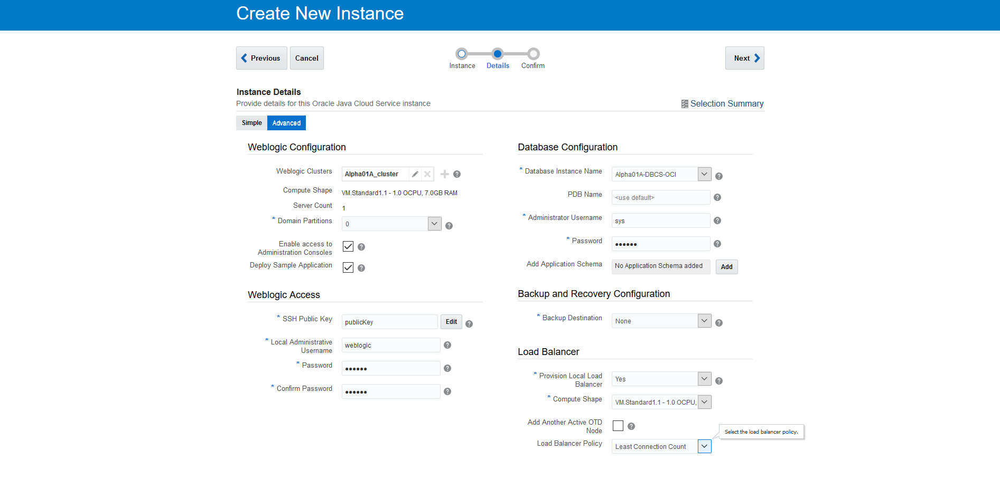

Next.

I'll verify the details of my service, paying particular attention to the:
Compute shape, Region, Availability domain, Subnet and the storage configuration.

Those all look fine, so I'll click Create.

Summary Picture??

In a moment, my new service will appear on the JCS console.

I can track provisioning progress here, in the Service Create and Delete History panel, simply by clicking Details.

And I can see that my service instance has been successfully provisioned.

run test app

SSH connection ??

