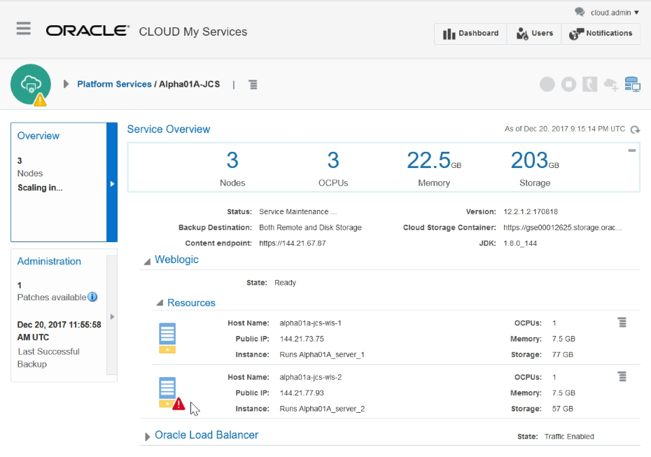

---
# ORACLE Cloud-Native DevOps workshop #
----
## Using the Command Line Interface ##

### About this tutorial ###
Oracle offers a PaaS Service Manager (PSM) Command Line Interface (CLI) that enables users of Oracle Application Container Cloud Service, Oracle Database Cloud Service, and Oracle Java Cloud Service to create, monitor and manage their service instances from a command shell or script.

For more information about PSM see the [documentation](https://docs.oracle.com/cloud/latest/jcs_gs/jcs_cli.htm).

### Prerequisites ###

- [Running Java Cloud Service,](../jcs-deploy/README.md)
- which has 2 nodes cluster or [scaled out Java Cloud Service](../jcs-scale-ui/README.md)
- [cURL command-line tool](http://curl.haxx.se/download.html). Usually cURL is already included in most of the Linux distributions and easy to install to Windows. You can use other tool to invoke REST API to download the latest version of the tool. (To install cURL is not scope of this documentation.)
- Python 3.3 or later. (To install Pyhton is not scope of this documentation.)

### Steps ###
#### Download the latest version of command line tool ####
First identify your REST API server name. If you log in to your Oracle cloud account with a US data center, use **psm.us.oraclecloud.com** otherwise, use **psm.europe.oraclecloud.com**.

Use cURL to send a request. The format is:

	curl -X GET -u username:password -H X-ID-TENANT-NAME:<identitydomain> https://<rest-server>/paas/core/api/v1.1/cli/<identitydomain>/client -o /u01/psmcli.zip

This will write the response to a file named `psmcli.zip`.

Open a terminal and execute the cURL command above with your credentials, identity domain identifier and REST API server name. REST 

	[oracle@localhost Desktop]$ curl -X GET -u john.i.smith@xxxxx.com:password -H X-ID-TENANT-NAME:hujohni https://psm.europe.oraclecloud.com/paas/core/api/v1.1/cli/hujohni/client -o /u01/psmcli.zip
	% Total    % Received % Xferd  Average Speed   Time    Time     Time  Current
                                   Dload  Upload   Total   Spent    Left  Speed
	100 45968  100 45968    0     0  10993      0  0:00:04  0:00:04 --:--:-- 10999
	[oracle@localhost Desktop]$

Change to directory `/u01` and list directory to check the downloaded psmcli.zip file.

	[oracle@localhost Desktop]$ cd /u01
	[oracle@localhost u01]$ ls
	app  content  dpct  oepe-12.2.1.4.201608161938  psmcli.zip  python  wins

#### Installing the Command Line Interface

Install the PaaS CLI as a Python package.

Open a terminal, change to directory or make sure you are in directory `/u01` and use the PIP tool to install the CLI Python package.
	
	[oracle@localhost Desktop]$ cd /u01
	[oracle@localhost Desktop]$ sudo -H /u01/python/bin/pip3 install -U psmcli.zip
	Processing ./psmcli.zip
	Collecting requests<=2.8.1,>=2.7.0 (from psmcli==1.1.7)
	  Downloading requests-2.8.1-py2.py3-none-any.whl (497kB)
    	100% |████████████████████████████████| 501kB 469kB/s 
	Collecting keyring<=5.6,>=5.4 (from psmcli==1.1.7)
	  Downloading keyring-5.6.tar.gz (69kB)
    	100% |████████████████████████████████| 71kB 1.0MB/s 
	Collecting colorama==0.3.3 (from psmcli==1.1.7)
	  Downloading colorama-0.3.3.tar.gz
	Collecting PyYAML==3.11 (from psmcli==1.1.7)
	  Downloading PyYAML-3.11.zip (371kB)
    	100% |████████████████████████████████| 378kB 725kB/s 
	Installing collected packages: requests, keyring, colorama, PyYAML, psmcli
	  Running setup.py install for keyring ... done
      Running setup.py install for colorama ... done
      Running setup.py install for PyYAML ... done
      Running setup.py install for psmcli ... done
	Successfully installed PyYAML-3.11 colorama-0.3.3 keyring-5.6 psmcli-1.1.7 requests-2.8.1
	You are using pip version 8.1.1, however version 8.1.2 is available.
	You should consider upgrading via the 'pip install --upgrade pip' command.
	[oracle@localhost u01]$

####Configuring the Command Line Interface####
Prior to running CLI commands, configure your connection to the Oracle cloud.

Open a terminal and run the `setup` command. When prompted, enter your cloud user name, password, and identity domain. For example:

	[oracle@localhost u01]$ psm setup
	Username: cloud.admin
	Password: 
	Retype Password: 
	Identity domain: gse00012625
	Region [us]: emea
	Output format [short]: json
	----------------------------------------------------
	'psm setup' was successful. Available services are:
	   o ANALYTICS : Oracle Analytics Cloud
	  o APICS : Oracle API Platform Cloud Service
	  o APICatalog : Oracle API Catalog Service
	  o BDCSCE : Oracle Big Data Cloud
	  o BOTSCFG : Oracle Bots Configuration Service
	  o BOTSCON : Oracle Bots Connector Service
	  o BOTSINT : Oracle Bots Intent Service
	  o BOTSMGM : Oracle Bots Management API Service
	  o BOTSPIP : Oracle Bots Pipeline Service
	  o BigDataAppliance : Oracle Big Data Cloud Service
	  o CONTAINER : Oracle Container Cloud Service
	  o CXAANA : Oracle CxA Analytics Service 
	  o CXACFG : Oracle CxA Configuration Service 
	  o CXACOL : Oracle CxA Collector Service 
	  o CXAPOD : Oracle CxA Pod Cloud Service 
	  o ContainerRegistry : Oracle Container Registry Service
	  o DHCS : Oracle Data Hub Cloud Service
	  o IDCS : Oracle Identity Cloud Service
	  o IDCSControlPlane : Oracle Identity Cloud Service
	  o IOTAssetMon : Oracle IoT Asset Monitoring Cloud Service
	  o IOTConnectedWrker : Oracle IoT Connected Worker Cloud Service
	  o IOTEnterpriseApps : Oracle Internet of Things Cloud - Enterprise
	  o IOTFleetMon : Oracle IoT Fleet Monitoring Cloud Service
	  o IOTProdMonitoring : Oracle IoT Production Monitoring Cloud Service
	  o IOTSvcAsset : Oracle IoT Asset Monitoring CX Cloud Service
	  o IntegrationCloud : Oracle Integration Cloud
	  o jcs : Oracle Java Cloud Service
	  o MobileCCC : Oracle Mobile Custom Code Container
	  o MobileCorePOD : Oracle Mobile Core POD
	  o MySQLCS : Oracle MySQL Cloud Service
	  o OAICS : Oracle Adaptive Intelligence Applications Offers Cloud Service
	  o OEHCS : Oracle Event Hub Cloud Service
	  o OEHPCS : Oracle Event Hub Cloud Service - Dedicated
	  o OMCE : Oracle Mobile Cloud Metering Service
	  o SOA : Oracle SOA Cloud Service
	  o VisualBuilder : Oracle Visual Builder Cloud Service
	  o accs : Oracle Application Container Cloud Service
	  o caching : Oracle Application Cache
	  o dbcs : Oracle Database Cloud Service
	  o dics : Oracle Data Integration Platform Cloud Service
	  o ggcs : Oracle GoldenGate Cloud Service
	  o stack : Oracle Cloud Stack Manager
	----------------------------------------------------
	[oracle@localhost u01]$

The CLI provides help text for each available command. Use the help (or h) parameter to:

View the available services in your configured cloud account. For example:

	[oracle@localhost u01]$ psm help

	DESCRIPTION
  		A command line tool to interact with Oracle Cloud Platform Services (PaaS)

	SYNOPSIS
  		psm <service> <command> [parameters]

	AVAILABLE SERVICES
	  o MySQLCS
	       Oracle Oracle MySQL Cloud Service
	  o accs
	       Oracle Application Container Cloud Service
	  o dbcs
	       Oracle Database Cloud Service
	  o ggcs
	       Oracle GoldenGate Cloud Service
	  o jcs
	       Oracle Java Cloud Service
	  o stack
	       Cloud Stack Manager
	  o setup
	       Configure psm client options
	  o update
	       Update psm client to latest version
	  o log
	       View or update psm client log level
	  o help
	       Show help

	AVAILABLE PARAMETERS
	  -v, --version  
	       Show current version of psm client

	[oracle@localhost u01]$ 

View the available commands for a service:

	[oracle@localhost u01]$ psm jcs help

	DESCRIPTION
	  Oracle Java Cloud Service
	
	SYNOPSIS
	  psm jcs <command> [parameters]
	
	AVAILABLE COMMANDS
	  o services
	       List all Oracle Java Cloud Service instances
	  o service
	       List an Oracle Java Cloud Service instance
	  o create-service
	       Create an Oracle Java Cloud Service instance
	  o import
	       Migrate an OnPremise WLS Domain to the Oracle Java Cloud Service instance
	  o delete-service
	       Delete an Oracle Java Cloud Service instance
	  o stop
	       Stop an Oracle Java Cloud Service instance, Managed Server or load balancer...
	  o start
	       Start an Oracle Java Cloud Service instance, Managed Server or load...
	  o restart
	       Restart an Oracle Java Cloud Service instance, Administration Server,...
	  o scale-out
	       Add a new Managed Server to the specified cluster to scale-out the Oracle...
	  o scale-in
	       Remove a Managed Server to scale-in the Oracle Java Cloud Service instance...
	  o scale-up
	       Scale the specified Administration Server or Managed Server node on an...
	  o scale-down
	       Scale the specified Administration Server or Managed Server node on an...
	  o view-backup-config
	       List backup configuration of an Oracle Java Cloud Service instance
	  o update-backup-config
	       Update backup configuration of an Oracle Java Cloud Service instance
	  o view-backups
	       List all backups of an Oracle Java Cloud Service instance
	  o view-backup
	       List a backup of an Oracle Java Cloud Service instance
	  o backup
	       Initiate an on-demand backup for an Oracle Java Cloud Service instance
	  o delete-backup
	       Delete a backup of an Oracle Java Cloud Service instance
	  o view-restores
	       List all restore operations for an Oracle Java Cloud Service instance
	  o view-restore
	       List a specified restore operation for an Oracle Java Cloud Service instance.
	  o restore
	       Restore an Oracle Java Cloud Service instance from the specified backup....
	  o available-patches
	       List all available patches for an Oracle Java Cloud Service instance
	  o applied-patches
	       List all applied patches for an Oracle Java Cloud Service instance
	  o precheck-patch
	       Precheck to identify potential issues that might prevent the specified...
	  o patch
	       Apply a patch to an Oracle Java Cloud Service instance
	  o rollback
	       Roll back a patch for an Oracle Java Cloud Service instance
	  o operation-status
	       View status of an Oracle Java Cloud Service instance operation
	  o access-rules
	       List access rules for Oracle Java Cloud Service instance
	  o create-access-rule
	       Create an access rule for Oracle Java Cloud Service instance
	  o delete-access-rule
	       Delete an access rule for Oracle Java Cloud Service instance
	  o enable-access-rule
	       Enable an access rule for Oracle Java Cloud Service instance
	  o disable-access-rule
	       Disable an access rule for Oracle Java Cloud Service instance
	  o help
	       Show help

	[oracle@localhost u01]$ 

View the available parameters for a specific command along with examples.
	
	[oracle@localhost Desktop]$ psm jcs create-service help
	
	DESCRIPTION
	  Create an Oracle Java Cloud Service instance
	
	SYNOPSIS
	  psm jcs create-service [parameters]
	       -c, --config-payload <value>
	       [-of, --output-format <value>]
	
	AVAILABLE PARAMETERS
	  -c, --config-payload    (file)
	       Path to JSON file containing Oracle Java Cloud Service provisioning
	       configuration parameters
	
	  -of, --output-format    (string)
	       Desired output format. Valid values are [json, html]
	
	EXAMPLES
	  psm jcs create-service -c /home/templates/create-jcs-service.json
	
	[oracle@localhost Desktop]$ 

#### Use the Command Line Interface ####
To get more details about specific service use psm service -s servicename command:

	[oracle@localhost Desktop]$ psm jcs service -s Alpha01A-JCS
	{
	    "serviceId":339378,
	    "serviceUuid":"4D5E9EB60AB6400FB5B8B3526F1D0F9B",
	    "serviceLogicalUuid":"6740B4C1F4D14D65B5C1156CE8C4B1A1",
	    "serviceName":"Alpha01A-JCS",
	    "serviceType":"JaaS",
	    "domainName":"gse00012625",
	    "serviceVersion":"12cRelease212",
	    "releaseVersion":"12.2.1.2.170818",
	    "baseReleaseVersion":"12.2.1.2.170818",
	    "metaVersion":"17.4.6-1712200213",
	    "serviceDescription":"Alpha Office Java Cloud Service",
	    "serviceLevel":"PAAS",
	    "subscription":"HOURLY",
	    "meteringFrequency":"HOURLY",
	    "edition":"EE",
	    "totalSSDStorage":0,
	    "storageContainer":"https://gse00012625.storage.oraclecloud.com/v1/Storage-gse00012625/Alpha01A_JCS_SC",
	    "state":"READY",
	    "serviceStateDisplayName":"Ready",
	    "clone":false,
	    "creator":"cloud.admin",
	    "creationDate":"2017-12-12T23:34:48.615+0000",
	    "serviceEntitlementId":"584286487",
	    "isBYOL":false,
	    "isManaged":false,
	    "iaasProvider":"NIMBULA",
	    "attributes":{
		"CONTENT_ROOT":{
		    "displayName":"Content endpoint",
		    "type":"STRING",
		    "value":"https://144.21.67.87",
		    "displayValue":"https://144.21.67.87",
		    "isKeyBinding":false
		},
		"FMW_ROOT":{
		    "displayName":"Open Fusion Middleware Control Console",
		    "type":"URL",
		    "value":"https://144.21.73.75:7002/em",
		    "displayValue":"https://144.21.73.75:7002/em",
		    "isKeyBinding":true
		},
		"customPayload":{
		    "displayName":"AppToCloud Payload",
		    "type":"CUSTOM_PAYLOAD",
		    "value":"",
		    "displayValue":"",
		    "isKeyBinding":false
		},
		"OTD_ROOT":{
		    "displayName":"Open Load Balancer Console",
		    "type":"URL",
		    "value":"https://144.21.67.87:8989/em",
		    "displayValue":"https://144.21.67.87:8989/em",
		    "isKeyBinding":true
		},
		"WLS_ROOT":{
		    "displayName":"Open WebLogic Server Console",
		    "type":"URL",
		    "value":"https://144.21.73.75:7002/console",
		    "displayValue":"https://144.21.73.75:7002/console",
		    "isKeyBinding":true
		},
		"jdkVersion":{
		    "displayName":"JDK",
		    "type":"STRING",
		    "value":"1.8.0_144",
		    "displayValue":"1.8.0_144",
		    "isKeyBinding":false
		},
		"cloudStorageContainer":{
		    "displayName":"Cloud Storage Container",
		    "type":"STRING",
		    "value":"https://gse00012625.storage.oraclecloud.com/v1/Storage-gse00012625/Alpha01A_JCS_SC",
		    "displayValue":"https://gse00012625.storage.oraclecloud.com/v1/Storage-gse00012625/Alpha01A_JCS_SC",
		    "isKeyBinding":false
		},
		"BACKUP_DESTINATION":{
		    "displayName":"Backup Destination",
		    "type":"STRING",
		    "value":"BOTH",
		    "displayValue":"Both Remote and Disk Storage",
		    "isKeyBinding":false
		}
	    },
	    "tags":{
		"items":[],
		"totalResults":0,
		"hasMore":false
	    },
	    "components":{
		"WLS":{
		    "serviceId":339378,
		    "componentId":283819,
		    "state":"READY",
		    "componentStateDisplayName":"Ready",
		    "version":"12.2.1.2.3",
		    "componentType":"WLS",
		    "creationDate":"2017-12-12T23:34:48.000+0000",
		    "instanceName":"WLS",
		    "instanceRole":"NONE",
		    "isKeyComponent":true,
		    "attributes":{
			"upperStackProductName":{
			    "displayName":"Fusion Middleware",
			    "type":"STRING",
			    "value":"",
			    "displayValue":"",
			    "isKeyBinding":false
			}
		    },
		    "vmInstances":{
			"alpha01a-jcs-wls-1":{
			    "vmId":308855,
			    "id":308855,
			    "uuid":"E5EB9B04867E4BF8ADD414CC26AA3C1A",
			    "hostName":"alpha01a-jcs-wls-1",
			    "label":"Alpha01A-JCS wls 1",
			    "ipAddress":"144.21.73.75",
			    "publicIpAddress":"144.21.73.75",
			    "usageType":"ADMIN_SERVER",
			    "role":"ADMIN_SERVER",
			    "componentType":"WLS",
			    "state":"READY",
			    "vmStateDisplayName":"Ready",
			    "shapeId":"oc3",
			    "totalStorage":78848,
			    "creationDate":"2017-12-12T23:34:48.000+0000",
			    "isAdminNode":true
			}
		    },
		    "adminHostName":"alpha01a-jcs-wls-1",
		    "hosts":{
			"userHosts":{
			    "alpha01a-jcs-wls-1":{
				"vmId":308855,
				"id":308855,
				"uuid":"E5EB9B04867E4BF8ADD414CC26AA3C1A",
				"hostName":"alpha01a-jcs-wls-1",
				"label":"Alpha01A-JCS wls 1",
				"ipAddress":"144.21.73.75",
				"publicIpAddress":"144.21.73.75",
				"usageType":"ADMIN_SERVER",
				"role":"ADMIN_SERVER",
				"componentType":"WLS",
				"state":"READY",
				"vmStateDisplayName":"Ready",
				"shapeId":"oc3",
				"totalStorage":78848,
				"creationDate":"2017-12-12T23:34:48.000+0000",
				"isAdminNode":true,
				"servers":{
				    "Alpha01A_server_1":{
					"serverId":138632,
					"serverName":"Alpha01A_server_1",
					"serverType":"MS",
					"serverRole":"JAAS_ROLE",
					"state":"READY",
					"serverStateDisplayName":"Ready",
					"creationDate":"2017-12-12T23:34:48.000+0000",
					"attributes":{
					    "heap_size":"2048",
					    "role":"managed",
					    "template":"Alpha01A_cluster_Template",
					    "perm_size":"256",
					    "ssl_port":"9074",
					    "port":"9073",
					    "server_type":"WLS",
					    "max_perm_size":"512",
					    "additional_jvm_args":"-Xloggc:/u01/data/domains/Alpha01A_domain/GC_Alpha01A_server_1.log -XX:+UseGCLogFileRotation -XX:NumberOfGCLogFiles=2 -XX:GCLogFileSize=5m -Dweblogic.rjvm.enableprotocolswitch=true -Djava.net.preferIPv4Stack=true -Doracle.security.jps.db.connect.max.retry=720 -Doracle.security.jps.db.connect.retry.interval=10000 -Djps.auth.debug=false -DUSE_JAAS=false -Djps.combiner.optimize.lazyeval=true -Djps.combiner.optimize=true -Djps.authz=ACC -Djps.subject.cache.key=5 -Djps.subject.cache.ttl=600000 -Dweblogic.security.SSL.minimumProtocolVersion=TLSv1.2 -XX:+UnlockCommercialFeatures -XX:+FlightRecorder -verbose:gc -XX:+PrintGCDetails -XX:+PrintGCTimeStamps -Dweblogic.data.canTransferAnyFile=true -Djava.security.egd=file:/dev/./urandom -XX:CompileThreshold=8000 -XX:ReservedCodeCacheSize=1024m -Dtangosol.coherence.transport.reliable=tmb -Dtangosol.coherence.socketprovider=tcp",
					    "cluster":"Alpha01A_cluster",
					    "heap_start":"256",
					    "ccsr":"DataGridConfig"
					}
				    },
				    "Alpha01A_adminserver":{
					"serverId":138631,
					"serverName":"Alpha01A_adminserver",
					"serverType":"ADMIN",
					"serverRole":"JAAS_ROLE",
					"state":"READY",
					"serverStateDisplayName":"Ready",
					"creationDate":"2017-12-12T23:34:48.000+0000",
					"attributes":{
					    "heap_start":"256",
					    "role":"admin",
					    "heap_size":"2048",
					    "server_type":"WLS",
					    "port":"9071",
					    "ssl_port":"9072",
					    "max_perm_size":"512",
					    "perm_size":"256",
					    "additional_jvm_args":"-Xloggc:/u01/data/domains/Alpha01A_domain/GC_Alpha01A_adminserver.log -XX:+UseGCLogFileRotation -XX:NumberOfGCLogFiles=2 -XX:GCLogFileSize=5m -Dweblogic.rjvm.enableprotocolswitch=true -Djava.net.preferIPv4Stack=true -Doracle.security.jps.db.connect.max.retry=720 -Doracle.security.jps.db.connect.retry.interval=10000 -Dweblogic.security.SSL.minimumProtocolVersion=TLSv1.2 -XX:+UnlockCommercialFeatures -XX:+FlightRecorder -verbose:gc -XX:+PrintGCDetails -XX:+PrintGCTimeStamps -Dweblogic.data.canTransferAnyFile=true  -Dweblogic.client.SocketConnectTimeoutInSecs=20"
					}
				    }
				},
				"storageVolumes":{
				    "domain":{
					"name":"domain",
					"size":"10GB",
					"partitions":"1"
				    },
				    "tools":{
					"name":"tools",
					"size":"10GB",
					"partitions":"1"
				    },
				    "jdk":{
					"name":"jdk",
					"size":"2GB",
					"partitions":"0"
				    },
				    "boot":{
					"name":"boot",
					"size":"25GB",
					"partitions":"1"
				    },
				    "middleware":{
					"name":"middleware",
					"size":"10GB",
					"partitions":"0"
				    },
				    "backup":{
					"name":"backup",
					"size":"20GB",
					"partitions":"1"
				    }
				}
			    }
			}
		    },
		    "paasServers":{},
		    "clusters":{
			"Alpha01A_cluster":{
			    "clusterId":339378,
			    "clusterName":"Alpha01A_cluster",
			    "clusterType":"PAAS",
			    "profile":"{\"type\":\"APPLICATION_CLUSTER\",\"default\":\"true\",\"external\":\"true\"}",
			    "creationDate":"2017-12-12T23:34:48.615+0000",
			    "paasServers":{
				"Alpha01A_server_1":{
				    "serverId":138632,
				    "serverName":"Alpha01A_server_1",
				    "serverType":"MS",
				    "serverRole":"JAAS_ROLE",
				    "state":"READY",
				    "serverStateDisplayName":"Ready",
				    "creationDate":"2017-12-12T23:34:48.000+0000",
				    "attributes":{
					"heap_size":"2048",
					"role":"managed",
					"template":"Alpha01A_cluster_Template",
					"perm_size":"256",
					"ssl_port":"9074",
					"port":"9073",
					"server_type":"WLS",
					"max_perm_size":"512",
					"additional_jvm_args":"-Xloggc:/u01/data/domains/Alpha01A_domain/GC_Alpha01A_server_1.log -XX:+UseGCLogFileRotation -XX:NumberOfGCLogFiles=2 -XX:GCLogFileSize=5m -Dweblogic.rjvm.enableprotocolswitch=true -Djava.net.preferIPv4Stack=true -Doracle.security.jps.db.connect.max.retry=720 -Doracle.security.jps.db.connect.retry.interval=10000 -Djps.auth.debug=false -DUSE_JAAS=false -Djps.combiner.optimize.lazyeval=true -Djps.combiner.optimize=true -Djps.authz=ACC -Djps.subject.cache.key=5 -Djps.subject.cache.ttl=600000 -Dweblogic.security.SSL.minimumProtocolVersion=TLSv1.2 -XX:+UnlockCommercialFeatures -XX:+FlightRecorder -verbose:gc -XX:+PrintGCDetails -XX:+PrintGCTimeStamps -Dweblogic.data.canTransferAnyFile=true -Djava.security.egd=file:/dev/./urandom -XX:CompileThreshold=8000 -XX:ReservedCodeCacheSize=1024m -Dtangosol.coherence.transport.reliable=tmb -Dtangosol.coherence.socketprovider=tcp",
					"cluster":"Alpha01A_cluster",
					"heap_start":"256",
					"ccsr":"DataGridConfig"
				    }
				}
			    }
			}
		    },
		    "displayName":"Weblogic"
		},
		"OTD":{
		    "serviceId":339378,
		    "componentId":283818,
		    "state":"READY",
		    "componentStateDisplayName":"Ready",
		    "version":"12.2.1.2.2",
		    "componentType":"OTD",
		    "creationDate":"2017-12-12T23:34:48.000+0000",
		    "instanceName":"OTD",
		    "instanceRole":"NONE",
		    "isKeyComponent":false,
		    "attributes":{},
		    "vmInstances":{
			"alpha01a-jcs-lb-1":{
			    "vmId":308854,
			    "id":308854,
			    "uuid":"4D8BF23889074B9ABAC6F73EE97FF6B8",
			    "hostName":"alpha01a-jcs-lb-1",
			    "label":"Alpha01A-JCS lb 1",
			    "ipAddress":"144.21.67.87",
			    "publicIpAddress":"144.21.67.87",
			    "usageType":"ADMIN_SERVER",
			    "role":"ADMIN_SERVER",
			    "componentType":"OTD",
			    "state":"READY",
			    "vmStateDisplayName":"Ready",
			    "shapeId":"oc3",
			    "totalStorage":70656,
			    "creationDate":"2017-12-12T23:34:48.000+0000",
			    "isAdminNode":true
			}
		    },
		    "adminHostName":"alpha01a-jcs-lb-1",
		    "hosts":{
			"userHosts":{
			    "alpha01a-jcs-lb-1":{
				"vmId":308854,
				"id":308854,
				"uuid":"4D8BF23889074B9ABAC6F73EE97FF6B8",
				"hostName":"alpha01a-jcs-lb-1",
				"label":"Alpha01A-JCS lb 1",
				"ipAddress":"144.21.67.87",
				"publicIpAddress":"144.21.67.87",
				"usageType":"ADMIN_SERVER",
				"role":"ADMIN_SERVER",
				"componentType":"OTD",
				"state":"READY",
				"vmStateDisplayName":"Ready",
				"shapeId":"oc3",
				"totalStorage":70656,
				"creationDate":"2017-12-12T23:34:48.000+0000",
				"isAdminNode":true,
				"servers":{
				    "Alpha01A-JCS-lb-1":{
					"serverId":138630,
					"serverName":"Alpha01A-JCS-lb-1",
					"serverType":"OTD_SERVER",
					"serverRole":"JAAS_ROLE",
					"state":"READY",
					"serverStateDisplayName":"Ready",
					"creationDate":"2017-12-12T23:34:47.000+0000",
					"attributes":{
					    "serviceListenerPort":"80",
					    "otdSystemAdminUser":"JaaS_System_OTD_Admin",
					    "otdConfigName":"opc-config",
					    "serviceSecuredListenerPort":"443",
					    "securedListenerPort":"8081",
					    "otdAdminUser":"weblogic",
					    "listenerPortEnabled":"true",
					    "adminPort":"8989",
					    "policy":"LEAST_CONNECTION_COUNT",
					    "listenerPort":"8080"
					}
				    }
				},
				"storageVolumes":{
				    "otd-instance":{
					"name":"otd-instance",
					"size":"6GB",
					"partitions":"1"
				    },
				    "tools":{
					"name":"tools",
					"size":"10GB",
					"partitions":"1"
				    },
				    "jdk":{
					"name":"jdk",
					"size":"2GB",
					"partitions":"0"
				    },
				    "boot":{
					"name":"boot",
					"size":"21GB",
					"partitions":"1"
				    },
				    "middleware":{
					"name":"middleware",
					"size":"10GB",
					"partitions":"0"
				    },
				    "backup":{
					"name":"backup",
					"size":"20GB",
					"partitions":"1"
				    }
				}
			    }
			}
		    },
		    "paasServers":{},
		    "clusters":{},
		    "displayName":"Oracle Load Balancer"
		}
	    },
	    "activityLogs":[
		{
		    "activityLogId":3827970,
		    "serviceName":"Alpha01A-JCS",
		    "serviceType":"jaas",
		    "identityDomain":"gse00012625",
		    "serviceId":339378,
		    "jobId":9813973,
		    "startDate":"2017-12-28T11:55:54.946+0000",
		    "endDate":"2017-12-28T12:36:24.971+0000",
		    "status":"SUCCEED",
		    "operationId":339378,
		    "operationType":"BACKUP",
		    "summaryMessage":"BACKUP",
		    "initiatedBy":"SYSTEM",
		    "messages":[
			{
			    "activityDate":"2017-12-28T11:55:54.946+0000",
			    "message":"Activity Submitted"
			},
			{
			    "activityDate":"2017-12-28T11:55:56.574+0000",
			    "message":"Activity Started"
			},
			{
			    "activityDate":"2017-12-28T12:36:22.507+0000",
			    "message":"The backup archive already exists in the block storage and does not need to be downloaded from the Oracle Storage Cloud Service container...Backup health check passed...Locked the WebLogic Server domain configuration...Started the backup of configuration data for WebLogic administration server and managed servers...Completed the backup of configuration data for WebLogic administration server and managed servers...Started the backup of configuration data for Oracle Traffic Director admin host alpha01a-jcs-lb-1...Completed the backup of configuration data for Oracle Traffic Director admin node on alpha01a-jcs-lb-1...Started the backup of database...Completed the backup of database...Capturing the service metadata...Completed the backup of service metadata...Unlocked the WebLogic Server domain configuration...Uploading the backup archive to the Oracle Storage Cloud Service container...Uploaded the object to the Oracle Storage Cloud Service container..."
			},
			{
			    "activityDate":"2017-12-28T12:36:22.878+0000",
			    "message":"SM-BKP-5127: There are no expired backups for the service Alpha01A-JCS."
			},
			{
			    "activityDate":"2017-12-28T12:36:24.955+0000",
			    "message":"Activity Ended"
			},
			{
			    "activityDate":"2017-12-28T12:36:24.971+0000",
			    "message":"Activity Ended"
			}
		    ]
		}
	    ],
	    "layeringMode":"None",
	    "serviceLevelDisplayName":"Oracle Java Cloud Service",
	    "editionDisplayName":"Enterprise Edition",
	    "meteringFrequencyDisplayName":"Hourly",
	    "OTD_ROOT":"https://144.21.67.87:8989/em",
	    "INTERNAL_ROOT":"https://144.21.67.87",
	    "jdkVersion":"1.8.0_144",
	    "enableAdminConsoles":"true",
	    "displayIDCSRoles":"true",
	    "provisionEngine":"Metadata_1_0",
	    "displayWLSAndFMWConsole":"true",
	    "customPayload":"null",
	    "CONTENT_ROOT":"https://144.21.67.87",
	    "WLS_ROOT":"https://144.21.73.75:7002/console",
	    "BACKUP_DESTINATION":"BOTH",
	    "cloudStorageContainer":"https://gse00012625.storage.oraclecloud.com/v1/Storage-gse00012625/Alpha01A_JCS_SC",
	    "identityTenancy":"StandardJCS",
	    "FMW_ROOT":"https://144.21.73.75:7002/em",
	    "totalSharedStorage":0,
	    "allAssociations":{
		"toAssociations":[
		    {
			"associationId":94111,
			"displayName":"APP_DB",
			"associationType":"USES",
			"associationName":"APP_DB",
			"associationState":"READY",
			"assocStatusMessage":"newly created",
			"isRequired":true,
			"creationDate":"2017-12-12T23:34:48.000+0000",
			"domain":"gse00012625",
			"destServiceType":"DBaaS",
			"destServiceName":"Alpha01A-DBCS",
			"serviceStatus":"READY",
			"serviceStateDisplayName":"Ready",
			"edition":"EE",
			"version":"12.1.0.2",
			"level":"PAAS",
			"ocpu":1,
			"associationStateDisplayName":"Ready",
			"assocNameDisplayName":"AppDB DbaaS association",
			"assocTypeDisplayName":"Uses",
			"assocTypeDescription":"Service A using Service B."
		    },
		    {
			"associationId":94112,
			"displayName":"INFRA_DB",
			"associationType":"DEPENDS_ON",
			"associationName":"INFRA_DB",
			"associationState":"READY",
			"assocStatusMessage":"newly created",
			"isRequired":true,
			"creationDate":"2017-12-12T23:34:48.000+0000",
			"domain":"gse00012625",
			"destServiceType":"DBaaS",
			"destServiceName":"Alpha01A-DBCS",
			"serviceStatus":"READY",
			"serviceStateDisplayName":"Ready",
			"edition":"EE",
			"version":"12.1.0.2",
			"level":"PAAS",
			"ocpu":1,
			"associationStateDisplayName":"Ready",
			"assocNameDisplayName":"DbaaS association",
			"assocTypeDisplayName":"Depends On",
			"assocTypeDescription":"Service A depends on Resource B/Service B."
		    }
		],
		"fromAssociations":[]
	    },
	    "region":"gbcom-south-1",
	    "patching":{
		"currentOperation":{
		    "operation":"NONE"
		},
		"updateStatus":"NORMAL_PENDING",
		"totalAvailablePatches":1
	    },
	    "backup":{
		"operationInProgress":{},
		"lastFailedBackupDate":"2017-12-19T11:56:01.634+0000",
		"lastBackupDate":"2017-12-28T11:55:56.750+0000"
	    }
	}

	[oracle@localhost Desktop]$ 

Leave this terminal open.

#### Scale-In a Java Cloud Service instance ####

First we need to check that the previously submitted Scale-Out request has been finished.[Sign in](../common/sign.in.to.oracle.cloud.md) to [https://cloud.oracle.com/sign-in](https://cloud.oracle.com/sign-in). On the dashboard open the Java Cloud Service Console.

Click the name of the service instance to which the application is deployed.

Check the Managed Server name on the second node.

Go back to the terminal where psm was used and get the help of the scale-in command.

	[oracle@localhost Desktop]$ psm jcs scale-in help
	
	DESCRIPTION
	  Scale in the service by deleting some of existing servers

	SYNOPSIS
	  psm jcs scale-in [parameters]
	       -s, --service-name <value>
	       -c, --config-payload <value>
	       [-of, --output-format <value>]
	       [-wc, --wait-until-complete <value>]

	AVAILABLE PARAMETERS
	  -s, --service-name    (string)  
	       Name of the Oracle Java Cloud Service instance

	  -c, --config-payload    (file)  
	       Path to JSON file containing payload for this command. A sample payload is
	       included in EXAMPLES below.

	  -of, --output-format    (string)  
	       Desired output format. Valid values are [short, json, html]

	  -wc, --wait-until-complete  (boolean)  
	       Wait until the command is complete. Valid values are [true, false]. Default is
	       false.

	EXAMPLES
	  psm jcs scale-in -s ExampleInstance -c /home/templates/scale-in-payload.json

	SAMPLE PAYLOAD
	Required properties are indicated as "required". Replace in the actual payload with real values.
	{
	    "scalingComponentType":"",
	    "force":"",
	    "components":{
		"WLS":{
		    "hosts":[],
		    "force":""
		},
		"OTD":{
		    "hosts":[]
		}
	    }
	}

	[oracle@localhost Desktop]$ 

According to the help give the necessary parameters to scale in the **Alpha01A-JCS** service, before running scaling command you can check content of *scale-in-payload.json* in */u01/content/cloud-native-devops-workshop/jcs-scale-in*.

	[oracle@localhost Desktop]$ psm jcs scale-in -s Alpha01A-JCS -c /u01/content/cloud-native-devops-workshop/jcs-scale-in/scale-in-payload.json
	{
	    "details":{
		"message":"Submitted job to scale in service [Alpha01A-JCS] in domain [gse00012625].",
		"jobId":"9628594"
	    }
	}
	Job ID : 9628594

	[oracle@localhost Desktop]$ 

The response shows the Scaling in Job has been submitted. You can get further information about the job using the provided jobId in the answer. Obviously if you have different service and/or managed server name then replace the parameters to reflect your environment properties.

	psm jcs operation-status -j 9628594 -of json

Go back to the browser where the service detail page is still opened and click on refresh or on Topology tile. Now you can see the service has changed to maintenance mode (exclamation mark) and Topology tile shows *Scaling...* is in progress.

