---
# ORACLE Cloud-Native DevOps workshop #

## Creating a Template for Oracle Cloud Stack Manager ##

### Introduction ###

This lab goes through the steps to use the Oracle Cloud Stack Manager console to create and test a custom stack template. In this case, we shall be creating a template to setup a Database Cloud Service .

### Background ###

To build and deploy their applications, businesses often require sophisticated environments that consist of multiple, integrated cloud services. Provisioning each of these services individually is time-consuming and error-prone. Oracle Cloud Stack Manager uses templates to provision a group of cloud resources called a stack.

Templates also support input parameters. Users can enter values for these parameters when they create a stack from the template.

Cloud Stack Manager provides several standard templates, but you can quickly create your own template using the web console.

### Prerequisites ###

+ Valid credentials for an Oracle Cloud account
+ An active subscription to Oracle Database Cloud Service

### Concepts ###

+ Cloud Stack 

	A cloud stack is a collection of related cloud services that you provision together with Oracle Cloud Stack Manager.

	It represents a complete environment whose functionality extends beyond a single service in Oracle Cloud. The services or resources that make up a cloud stack are created, deleted, started, and stopped together as a unit, but these services can also be individually accessed, configured and managed by using their service-specific interfaces. A cloud stack is created from a template. 

+ Stack Template

	A template in Oracle Cloud Stack Manager defines the cloud services that are part of a stack as well as how they are provisioned in Oracle Cloud. They act like blueprints for the creation of cloud environments. 

	You can rapidly provision similar environments, in the same cloud data center or in different ones, by creating multiple stacks from a single template. After a stack is created from a template, its lifecycle is completely independent from the template’s lifecycle. In other words, modifications you make to the template will not affect existing cloud stacks.

	Templates are text files that use the standard YAML syntax. You can either use the template authoring tools in the Oracle Cloud Stack Manager console, or import template files into Oracle Cloud Stack Manager that you authored with some other tool.

	A template is in one of two states:
    + Published — Users in this cloud account can create stacks from this template.
    + Unpublished — This template is still in-progress, and is not available for stack creation.
	
	These states and their supported operations are illustrated in the following diagram:

	

+ Template Components

	A template is comprised of several elements:
	+ Resources define the cloud services to create and the dependencies between them.
	+ Template parameters allow users of the template to customize the template for a specific cloud stack.
	+ Attributes enable you to use the runtime characteristics of one resource as parameters for the creation of another resource.
	+ Conditions change a template’s behavior based on different criteria like the values of template parameters.

### Steps ###

1. Configure Template Storage
2. Create a Template
3. Add Template Parameters
4. Create a Resource
5. Publish the Template
6. Test the Template

#### Configure Template Storage ####

If this is the first time for anyone in this Oracle Cloud account to work with templates in the Cloud Stack Manager console, you must create a cloud storage container for your unpublished template files.

+ Sign in to Oracle Cloud (https://cloud.oracle.com/home)
+ From the My Services Dashboard, locate the Storage Classic tile and click its name. If this tile is not visible, click Customize Dashboard.

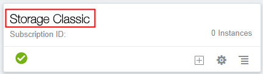

+ Record the value of the REST Endpoint. For example, https://foo.storage.oraclecloud.com/v1/MyService-bar.
+ Click Open Service Console at the top right corner of the page.
+ From the Storage Classic console, click Create Container.
+ For Name, enter StackTemplates. Then click Create.
+ Click the Navigation menu ie Dashboard Menu Icon at the top left corner of the page, and then select My Services.
+ From the My Services Dashboard, click the Navigation menu ie Dashboard Menu Icon at the top left corner of the page. Then expand My Services and select Database (Note: You can access Cloud Stack Manager from any Oracle Platform service).
+ From the Oracle Database Cloud Service console, click the Navigation menu ie Dashboard Menu Icon at the top left corner of the page, and then select Cloud Stack
+ From the Oracle Cloud Stack Manager console, click Templates.

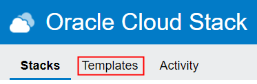

+ Click the Unpublished tab. The Cloud Storage Credentials dialog displays.
(Note: You can also update the existing storage settings by clicking Configure cloud storage Gear Icon) 
+ For Cloud Storage Container, enter Your-Storage-REST-URL/StackTemplates. For example, https://foo.storage.oraclecloud.com/v1/MyService-bar/StackTemplates.
+ For Username and Password, enter your Oracle Cloud credentials, or the credentials of another Oracle Cloud user who has write access to this storage container.

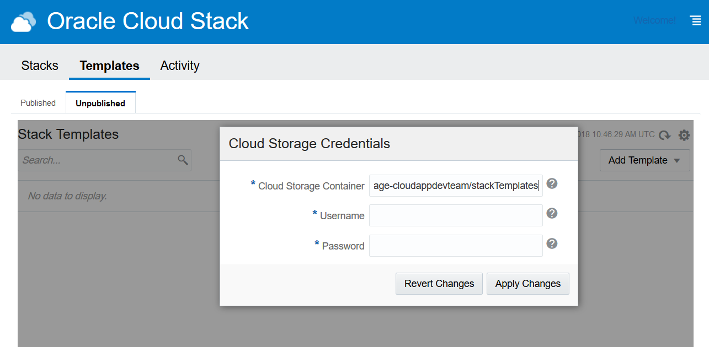

+ Click Apply Changes.

#### Create a Template ####

+ From the Unpublished Templates page, click Add Template, and then select Create New Template. The Template Builder is displayed.

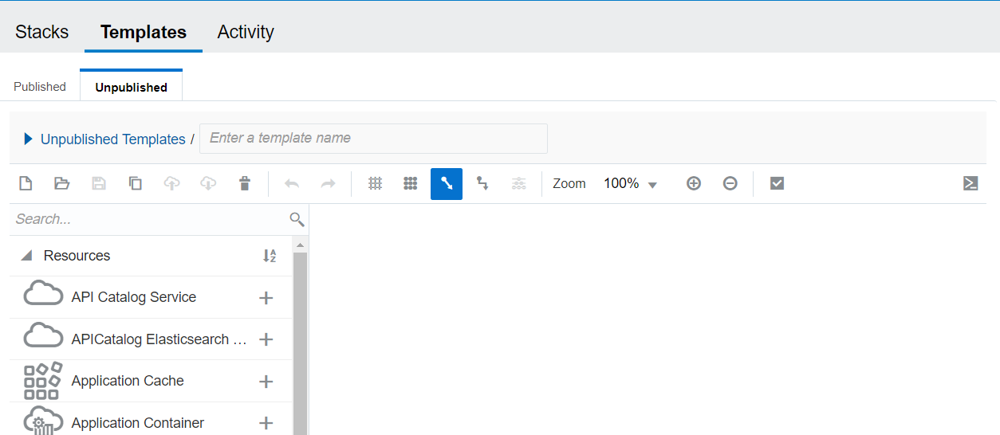

+ Above the toolbar, click Right Arrow Icon. In the first input field, set the template's name to ‘MyDBCSTemplate’. Set the templateDescription to ‘Create a DBCS instance’. Click 'Save current template' icon.

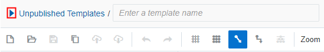

#### Add Template Parameters ####

+ In the left panel of the Template Builder, to the right of Parameters, click Add parameter (Plus Icon)

+ For the parameter's name, enter dbPassword.
+ Configure the parameter:
	- description: The password for the DB system administrator
	- label: Database Password
	- mandatory: true
	- type: Password
	- maxLength: 30
	- minLength: 8
+ Click Apply Changes. This results in a Parameter getting created

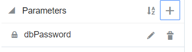

+ Click Add parameter (Plus Icon) again. For the parameter's name, enter publicKey.
+ Configure the parameters:
	- description: Generate a new key pair, enter a key value, or upload a key file
	- label: SSH Public Key
	- mandatory: true
	- type: Ssh
+ Click Apply Changes. And another parameter gets created. Click 'Save current template' icon.

#### Create a Resource ####

+ In the left panel of the Template Builder, expand Resources and locate the Database resource type. You can use the Search field if you prefer. 

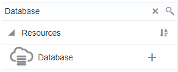

+ Either drag and drop the Database resource onto the canvas area (right side), or click Add resource (Plus Icon).

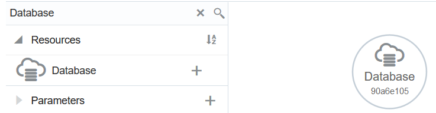

+ Right Click on the 'Database' Circle in the canvas and click on Edit.

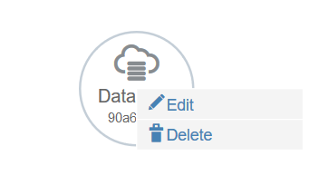

+ For serviceName, enter the text Fn to display a list of functions. Select the function Fn::GetParam.

+ Replace the text paramName with serviceName.

`'Fn::GetParam': serviceName`
	
	Note: You do not have to explicitly define the serviceName parameter in your templates.

+ Update this value and use the Fn::Join function to add the text "DB" to the end of the stack's name. Pass the arguments to this function as a sequence:

+ For vmPublicKeyText, retrieve the value of your publicKey parameter: `'Fn::GetParam': publicKey`
+ Expand parameters, and then expand 0.

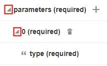
 
+ Update these required resource parameters:
	+ type: `db`
    + usableStorage: `15`
    + adminPassword: `'Fn::GetParam': dbPassword`
    + sid: `ORCL`
    + backupDestination: `NONE`

+ Click Apply Changes. Click 'Save current template' icon. 

#### Publish the Template ####

+ Click Validate current template icon. If there are any validation errors, click 'Open YAML editor' (Command Prompt Icon) to view the full template definition, and then correct the errors. 
+ If all is fine, then Save and click 'Publish current template'.
+ Click the Published tab, if you search by the name of the template created just now (MyDBCSTemplate), you should see it.

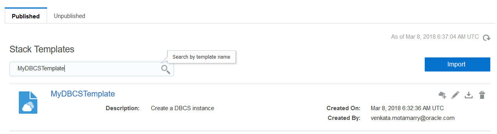

#### Test the Template ####

+ Click on the + symbol (on the right corresponding to the template) in order to spin up a stack from this template. 
+ Configure the Stack parameters. Fill in the Name, provide a SSH Public Key (if you already have one or ask the system to generate one for you) and Database Password. Click on Next.
Sample values: Name -> MyStack, Database Password -> Ach1z0#d.

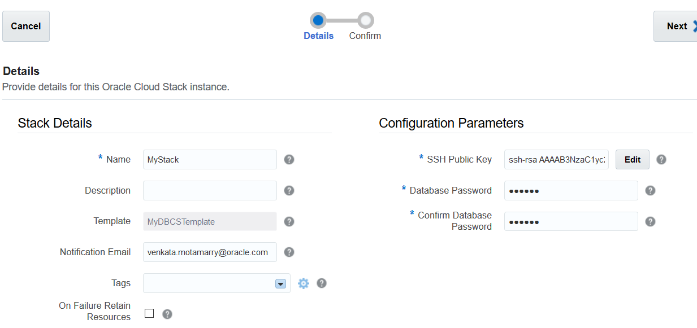

+ Verify the values on the next page. Confirm if all is fine else go back and feed in new values.
+ On clicking the Confirm button, request for Stack provisioning is submitted.

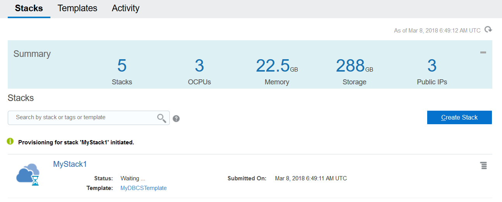
